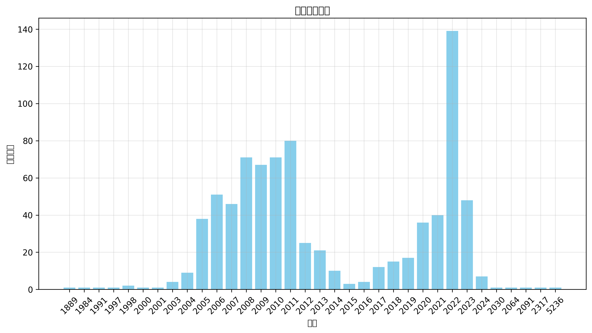

# 变身文学与小说存档库一（非限制级，未分类） 数据分析
*生成日期：2025-02-27*

## 执行摘要
本报告分析了 827 个项目的时间分布和主题分类。

## 时间分布

### 年度明细

| 年份 | 数量 |
|------|-------|
| 5236 | 1 |
| 2317 | 1 |
| 2091 | 1 |
| 2064 | 1 |
| 2030 | 1 |
| 2024 | 7 |
| 2023 | 48 |
| 2022 | 139 |
| 2021 | 40 |
| 2020 | 36 |
| 2019 | 17 |
| 2018 | 15 |
| 2017 | 12 |
| 2016 | 4 |
| 2015 | 3 |
| 2014 | 10 |
| 2013 | 21 |
| 2012 | 25 |
| 2011 | 80 |
| 2010 | 71 |
| 2009 | 67 |
| 2008 | 71 |
| 2007 | 46 |
| 2006 | 51 |
| 2005 | 38 |
| 2004 | 9 |
| 2003 | 4 |
| 2001 | 1 |
| 2000 | 1 |
| 1998 | 2 |
| 1997 | 1 |
| 1991 | 1 |
| 1984 | 1 |
| 1889 | 1 |

## 地区分布

  `未知: 1,311 (51.4%)`  `中国大陆: 1,163 (45.6%)`  `中国: 48 (1.9%)`  `台湾: 9 (0.4%)`  `日本: 9 (0.4%)`  `美国: 3 (0.1%)`  `云南: 1 (0.0%)`  `南棒: 1 (0.0%)`  `港岛地区: 1 (0.0%)`  `英国: 1 (0.0%)`  `青龙国（华国）: 1 (0.0%)`  `韩国: 1 (0.0%)`  `香港: 1 (0.0%)`

## 主题分析

### 标签词云

### 热门标签

**前50个热门标签：**

  `跨性别: 1,854`  `性别认同: 1,197`  `自我探索: 1,165`  `伪娘: 909`  `变身小说: 823`  `变身: 752`  `性转: 514`  `奇幻: 467`  `二次元: 466`  `小说: 430`  `冒险: 362`  `性转小说: 311`  `魔法: 265`  `穿越: 229`  `异世界: 213`  `爱情: 211`  `青春成长: 204`  `男娘: 191`  `自我认同: 189`  `轻小说: 187`  `青春: 176`  `成长: 175`  `性别转换: 166`  `重生: 126`  `友情: 125`  `奇幻冒险: 123`  `幻想: 120`  `校园生活: 117`  `奇幻小说: 110`  `二次元文化: 102`  `家庭关系: 101`  `校园: 94`  `恋爱: 93`  `玄幻: 92`  `情感纠葛: 91`  `幽默: 86`  `幻想小说: 79`  `科幻: 79`  `青春小说: 79`  `网络小说: 71`  `战斗: 69`  `言情: 69`  `青春校园: 69`  `武侠: 66`  `角色成长: 66`  `角色扮演: 63`  `自我认知: 62`  `古代: 61`  `百合: 60`  `伪娘小说: 58`

查看更多标签

 `后宫: 58` `穿越小说: 58` `成长故事: 57` `变装: 51` `幻想文学: 51` `悬疑: 50` `魔法少女: 50` `修仙: 49` `变身嫁人: 49` `游戏: 45` `校园小说: 43` `友谊: 42` `漫画: 40` `跨性别小说: 40` `都市: 38` `二次元小说: 37` `纯爱: 37` `虚拟现实: 36` `心理探索: 35` `搞笑: 35` `火影忍者: 35` `转生: 35` `古风: 34` `网络文学: 34` `修真: 32` `复仇: 32` `家庭: 31` `成长小说: 31` `身份认同: 31` `魔女: 31` `动漫: 30` `变嫁: 30` `心理描写: 30` `情感: 30` `末世: 30` `超能力: 30` `仙侠: 28` `青春文学: 28` `同人小说: 26` `女性角色: 26` `青春爱情: 26` `女性成长: 25` `情感探索: 25` `吸血鬼: 24` `奇幻文学: 24` `权力斗争: 24` `家庭伦理: 22` `异能: 22` `性别转变: 22` `情感冲突: 22` `青春冒险: 22` `幽默讽刺: 21` `异世界冒险: 21` `忍者: 21` `日常生活: 21` `魔幻: 21` `丧尸: 19` `变性: 19` `妖怪: 18` `心理成长: 18` `社会问题: 18` `舰娘: 18` `角色发展: 18` `超自然: 18` `亲情: 17` `命运: 17` `幻想冒险: 17` `黑色幽默: 17` `二次元文学: 16` `少女: 16` `异界: 16` `心理冲突: 16` `女性主角: 15` `情感关系: 15` `神话: 15` `魔王: 15` `变百: 14` `战争: 14` `暴力: 14` `江湖: 14` `科幻小说: 14` `超现实: 14` `龙族: 14` `同人: 13` `大学生活: 13` `心理斗争: 13` `末日: 13` `网络连载: 13` `荒诞幽默: 13` `萝莉: 13` `都市小说: 13` `青少年成长: 13` `TS变身: 12` `伪娘文化: 12` `修炼: 12` `勇者: 12` `女主角: 12` `少女成长: 12` `恐怖: 12` `更新日志: 12` `治愈: 12` `灵异: 12` `生存: 12` `身份错位: 12` `SM: 11` `古代小说: 11` `女仆: 11` `家族纷争: 11` `文学作品: 11` `日常: 11` `社会讽刺: 11` `精灵: 11` `耽美: 11` `角色设定: 11` `内心挣扎: 10` `孤独: 10` `少年成长: 10` `性别角色: 10` `政治阴谋: 10` `网络游戏: 10` `荒诞: 10` `虚拟游戏: 10` `规则怪谈: 10` `魔族: 10` `冒险小说: 9` `励志: 9` `历史: 9` `历史小说: 9` `同人创作: 9` `女装: 9` `嫁人: 9` `崩坏: 9` `幻想世界: 9` `幻想乡: 9` `幻想故事: 9` `性别探索: 9` `恶搞: 9` `恶魔: 9` `悲剧: 9` `惊悚: 9` `校园暴力: 9` `梦境: 9` `海贼王: 9` `炼金术: 9` `现代小说: 9` `社会压力: 9` `自我救赎: 9` `血族: 9` `转世: 9` `骑士: 9` `魔法世界: 9` `兄妹情: 8` `冒险故事: 8` `军事: 8` `史诗: 8` `同性恋: 8` `婚姻: 8` `宅文化: 8` `宿命: 8` `心理变化: 8` `情感成长: 8` `游戏冒险: 8` `爱情小说: 8` `网游: 8` `血腥: 8` `血腥暴力: 8` `西幻: 8` `身份错乱: 8` `青春幻想: 8` `魅魔: 8` `元叙事: 7` `动漫文化: 7` `双胞胎: 7` `变身文学: 7` `复活: 7` `天使: 7` `宗教: 7` `宫廷斗争: 7` `幽默小说: 7` `性转故事: 7` `情感故事: 7` `文学: 7` `权谋: 7` `校园爱情: 7` `漫画改编: 7` `爱情故事: 7` `超自然现象: 7` `跨性别主题: 7` `跨性别文学: 7` `身体交换: 7` `青少年文学: 7` `魔法学院: 7` `黑帮: 7` `剑术: 6` `动漫小说: 6` `变身文: 6` `命运交织: 6` `奥特曼: 6` `女性主义: 6` `姐妹情: 6` `孤儿院: 6` `家庭悲剧: 6` `家庭情感: 6` `少女漫画: 6` `巫女: 6` `师徒关系: 6` `幽默搞笑: 6` `幽默调侃: 6` `心理创伤: 6` `文学创作: 6` `无限流: 6` `暴力冲突: 6` `更新公告: 6` `杀手: 6` `枪战: 6` `校园恋爱: 6` `校园故事: 6` `校园青春: 6` `武道: 6` `江湖恩怨: 6` `灵异事件: 6` `男娘小说: 6` `篮球: 6` `职场: 6` `荒诞现实: 6` `虚拟世界: 6` `角色转变: 6` `跨性别题材: 6` `青少年: 6` `青年小说: 6` `亡灵: 5` `人性: 5` `人性探索: 5` `兄妹关系: 5` `兽人: 5` `初恋: 5` `制服: 5` `动作: 5` `勇气: 5` `历史背景: 5` `原神: 5` `友情与爱情: 5` `反派: 5` `反派角色: 5` `变嫁小说: 5` `变性小说: 5` `史诗战争: 5` `唐朝: 5` `围棋: 5` `圣杯战争: 5` `奇幻故事: 5` `契约: 5` `女主成长: 5` `女扮男装: 5` `女神: 5` `娱乐圈: 5` `家庭纷争: 5` `家庭责任: 5` `家族传承: 5` `异界冒险: 5` `心理挣扎: 5` `性别变换: 5` `情感交流: 5` `情感发展: 5` `情感小说: 5` `情色: 5` `政治斗争: 5` `日向雏田: 5` `日本文化: 5` `时崎狂三: 5` `未来科技: 5` `校园欺凌: 5` `武侠小说: 5` `母爱: 5` `洪荒: 5` `海贼: 5` `游戏小说: 5` `游戏改编: 5` `现代: 5` `现实主义: 5` `现实讽刺: 5` `生存冒险: 5` `生存游戏: 5` `男变女: 5` `男性转女性: 5` `社会批判: 5` `社会现实: 5` `社会认同: 5` `系统: 5` `系统流: 5` `约会大作战: 5` `网络文化: 5` `职场生活: 5` `英雄主义: 5` `虚拟网游: 5` `血战: 5` `角色互动: 5` `角色塑造: 5` `角色认同: 5` `赛马娘: 5` `超级英雄: 5` `身份探索: 5` `身体异变: 5` `转变: 5` `转生小说: 5` `都市生活: 5` `重生小说: 5` `青春恋爱: 5` `音乐: 5` `VRMMORPG: 4` `个人成长: 4` `中世纪: 4` `亡灵法师: 4` `亲情纠葛: 4` `人际关系: 4` `修女: 4` `催眠: 4` `克苏鲁: 4` `克苏鲁神话: 4` `内心独白: 4` `农村生活: 4` `剑道: 4` `医术: 4` `变身情节: 4` `变身故事: 4` `变身题材: 4` `古代爱情: 4` `召唤: 4` `同人文: 4` `命运抉择: 4` `命运捉弄: 4` `命运转折: 4` `团队合作: 4` `外星人: 4` `女主: 4` `女同性恋: 4` `女孩成长: 4` `女性向: 4` `女权主义: 4` `娘化: 4` `婚礼: 4` `学园都市: 4` `宅男: 4` `家族: 4` `家族关系: 4` `小说创作: 4` `小说档案: 4` `师徒情深: 4` `幽灵: 4` `幽默冒险: 4` `幽默对话: 4` `异世: 4` `异形: 4` `心理恐怖: 4` `心理探讨: 4` `心理转变: 4` `忍者学校: 4` `快穿: 4` `悲情: 4` `成人向: 4` `成人幽默: 4` `成长冒险: 4` `成长烦恼: 4` `探索: 4` `推理: 4` `救赎: 4` `文学实验: 4` `斗气: 4` `日向家族: 4` `日本轻小说: 4` `未来战争: 4` `机械: 4` `校园喜剧: 4` `武术: 4` `漫威宇宙: 4` `漫画小说: 4` `火影同人: 4` `灵魂互换: 4` `父女关系: 4` `犯罪: 4` `狐妖: 4` `狐娘: 4` `狐狸精: 4` `玄幻小说: 4` `现代都市: 4` `现实困境: 4` `生活琐事: 4` `电子竞技: 4` `男女关系: 4` `神话传说: 4` `穿越时空: 4` `系统文: 4` `绝望: 4` `自嘲幽默: 4` `自我发现: 4` `西方奇幻: 4` `角色反转: 4` `角色变身: 4` `角色对话: 4` `角色扮演游戏: 4` `角色探索: 4` `赛博朋克: 4` `跨时空: 4` `身份危机: 4` `身份迷失: 4` `逃亡: 4` `都市传说: 4` `都市奇幻: 4` `青年文学: 4` `青春期: 4` `高考: 4` `魔法战斗: 4` `魔物: 4` `魔道: 4` `黑暗幽默: 4` `黑道: 4` `龙珠: 4` `DC宇宙: 3` `TS: 3` `三国: 3` `两性关系: 3` `乡村生活: 3` `人工智能: 3` `人性探讨: 3` `仙界: 3` `伪娘文学: 3` `侦探: 3` `修仙小说: 3` `修行: 3` `兄弟情: 3` `全息游戏: 3` `公主: 3` `冒险之旅: 3` `写作技巧: 3` `创作困境: 3` `剑斗: 3` `医院: 3` `友情互动: 3` `反串: 3` `反乌托邦: 3` `反抗: 3` `反转剧情: 3` `变装小说: 3` `古代穿越: 3` `命运交错: 3` `命运逆转: 3` `哈利·波特: 3` `哲学思考: 3` `喜剧: 3` `复仇情节: 3` `夜总会: 3` `女性: 3` `女性力量: 3` `女性意识: 3` `女权: 3` `妖族: 3` `姐姐: 3` `宇宙战争: 3` `宇智波一族: 3` `宗教寓言: 3` `宝可梦: 3` `实验伦理: 3` `宫廷: 3` `家庭压力: 3` `家庭矛盾: 3` `家庭纠纷: 3` `家族秘密: 3` `家族秘辛: 3` `宿命论: 3` `少年小说: 3` `异世界穿越: 3` `异变: 3` `异界穿越: 3` `心灵成长: 3` `心理扭曲: 3` `心理治疗: 3` `心理阴影: 3` `性别反转: 3` `性别转化: 3` `恋爱小说: 3` `恋爱纠葛: 3` `悬疑小说: 3` `成人内容: 3` `成长历程: 3` `战斗策略: 3` `探险: 3` `文化传承: 3` `文化冲突: 3` `文艺: 3` `斗罗大陆: 3` `日本小说: 3` `时空乱流: 3` `末日题材: 3` `机器人: 3` `机甲: 3` `机甲战斗: 3` `权谋斗争: 3` `柯南: 3` `校园回忆: 3` `梦想: 3` `次元穿越: 3` `死亡: 3` `死神: 3` `母子关系: 3` `毕业: 3` `民间传说: 3` `汉朝: 3` `法师: 3` `浪漫: 3` `游戏文化: 3` `灵力: 3` `灵气复苏: 3` `灵魂交换: 3` `灵魂转世: 3` `灵魂转移: 3` `灾难: 3` `爽文: 3` `王子: 3` `现代生活: 3` `现代职场: 3` `现实与幻想: 3` `生存挑战: 3` `生死抉择: 3` `生死考验: 3` `生活写实: 3` `电竞: 3` `男主角: 3` `男穿女: 3` `直播: 3` `短篇小说: 3` `社会观察: 3` `社会边缘: 3` `社会阶层: 3` `禁忌之爱: 3` `科技幻想: 3` `系统小说: 3` `网吧生活: 3` `网文: 3` `网络互动: 3` `网络直播: 3` `网络竞技: 3` `美少女: 3` `英雄救美: 3` `英雄联盟: 3` `荒诞喜剧: 3` `药物: 3` `萝莉控: 3` `蒸汽朋克: 3` `虚构世界: 3` `虚构文学: 3` `虫族: 3` `角色互换: 3` `言情小说: 3` `记忆丧失: 3` `讽刺: 3` `讽刺幽默: 3` `读者互动: 3` `责任: 3` `跨性别故事: 3` `跨界混搭: 3` `身体改造: 3` `轮回: 3` `轻松幽默: 3` `轻松搞笑: 3` `都市幻想: 3` `阎王: 3` `阴阳师: 3` `附身: 3` `雷电芽衣: 3` `青年成长: 3` `青春探索: 3` `青春热血: 3` `青春迷茫: 3` `青梅竹马: 3` `预言: 3` `鬼怪: 3` `鬼族: 3` `魔兽世界: 3` `魔法学校: 3` `魔法对决: 3` `魔法师: 3` `黑暗幻想: 3` `ACG: 2` `R18: 2` `YY小说: 2` `世界构建: 2` `世界观构建: 2` `世界设定: 2` `东京喰种: 2` `东方Project: 2` `东方project: 2` `中二病: 2` `中国网络文学: 2` `中性角色: 2` `中秋节: 2` `主神空间: 2` `乌托邦: 2` `九尾狐: 2` `书评互动: 2` `二战: 2` `二次元文艺: 2` `亚人: 2` `人体实验: 2` `人偶: 2` `人物成长: 2` `人生低谷: 2` `人造人: 2` `仙人: 2` `任务: 2` `任务系统: 2` `传统文化: 2` `伦理争议: 2` `伪娘故事: 2` `作者自述: 2` `佣兵: 2` `信仰: 2` `假面骑士: 2` `傀儡术: 2` `僵尸: 2` `元神: 2` `兄妹纠葛: 2` `兄弟情谊: 2` `光明教会: 2` `全职猎人: 2` `内功: 2` `内心探索: 2` `冒险战斗: 2` `冒险者: 2` `写作心路: 2` `军旅: 2` `决斗: 2` `创世神: 2` `创作心路: 2` `剑圣: 2` `剑士: 2` `剑术对决: 2` `剧情: 2` `剧情发展: 2` `办公室恋情: 2` `动漫同人: 2` `动画: 2` `动画改编: 2` `医疗: 2` `历史传说: 2` `历史感: 2` `历史改编: 2` `历史架空: 2` `原创: 2` `友谊与爱情: 2` `友谊与背叛: 2` `双重身份: 2` `反套路: 2` `反思: 2` `反转命运: 2` `变身剧情: 2` `叛忍: 2` `古代架空: 2` `古代生活: 2` `古代背景: 2` `召唤师: 2` `同人作品: 2` `同人改编: 2` `名侦探柯南: 2` `吟游诗人: 2` `命理: 2` `命运交响: 2` `命运女神: 2` `命运轮回: 2` `哥布林: 2` `哲学: 2` `哲学探讨: 2` `唐代: 2` `商业斗争: 2` `喜剧元素: 2` `回忆: 2` `团队协作: 2` `城市生活: 2` `基因工程: 2` `复仇计划: 2` `复杂情感: 2` `多元宇宙: 2` `多重身份: 2` `夜女一族: 2` `失恋: 2` `奇幻世界: 2` `奇遇事件: 2` `契约者: 2` `奥特曼同人: 2` `女侠: 2` `女友: 2` `女巫: 2` `女性化: 2` `女性自我探索: 2` `女性身体: 2` `女王: 2` `女装大佬: 2` `女频小说: 2` `奴隶制: 2` `妖精: 2` `姐弟情: 2` `学生会: 2` `宅男生活: 2` `宗教仪式: 2` `宗教元素: 2` `宫廷权谋: 2` `宫廷秘事: 2` `家庭支持: 2` `家庭暴力: 2` `家庭温情: 2` `家族伦理: 2` `家族恩怨: 2` `家族纠纷: 2` `家族羁绊: 2` `寄坏虫: 2` `少女冒险: 2` `少年少女: 2` `崩坏三: 2` `巨龙: 2` `市井生活: 2` `师徒恋: 2` `平行世界: 2` `幸存者: 2` `幻幻想: 2` `幻想史诗: 2` `幻梦: 2` `幻觉: 2` `幼儿园: 2` `幽默喜剧: 2` `幽默奇幻: 2` `幽默风趣: 2` `异世界小说: 2` `异兽: 2` `异能者: 2` `强暴: 2` `心灵探索: 2` `心理: 2` `心理健康: 2` `心理小说: 2` `心理悬疑: 2` `心理惊悚: 2` `心理战: 2` `心理操控: 2` `怀孕: 2` `性别交换: 2` `性别身份: 2` `性别错位: 2` `性转情节: 2` `性转换: 2` `性转文学: 2` `恶搞小说: 2` `恶魔契约: 2` `悲剧爱情: 2` `情劫: 2` `情感困惑: 2` `情感挣扎: 2` `情色描写: 2` `惊悚小说: 2` `惊悚游戏: 2` `成人情色: 2` `成年礼: 2` `成长期: 2` `成长经历: 2` `战争史诗: 2` `战争策略: 2` `战斗场面: 2` `战舰: 2` `扶她: 2` `技能解析: 2` `技能设定: 2` `故事: 2` `教皇: 2` `文化探讨: 2` `文化背景: 2` `文化讽刺: 2` `斗破苍穹: 2` `日向光: 2` `日本: 2` `日本动漫: 2` `时空错位: 2` `时间跳跃: 2` `明日方舟: 2` `明朝: 2` `春野樱: 2` `暗杀: 2` `暗黑现实: 2` `暴力性爱: 2` `更新通知: 2` `朋友: 2` `未来: 2` `未来世界: 2` `未来科幻: 2` `权力与欲望: 2` `权谋纷争: 2` `枪械对决: 2` `架空历史: 2` `校园奇遇: 2` `校园幻想: 2` `校园成长: 2` `校园文化: 2` `档案馆: 2` `梦境奇遇: 2` `梦幻现实: 2` `梦想与现实: 2` `次元文化: 2` `欲望纠葛: 2` `死亡与重生: 2` `母亲: 2` `母女情: 2` `毒药: 2` `比比东: 2` `毛利兰: 2` `求生: 2` `油女美姬: 2` `治愈系: 2` `洞穴探险: 2` `海军: 2` `海盗: 2` `淫魔: 2` `深渊: 2` `混沌至宝: 2` `温馨: 2` `游戏世界: 2` `游戏主播: 2` `游戏穿越: 2` `游戏系统: 2` `游戏设定: 2` `漫画创作: 2` `火影改编: 2` `灵凤: 2` `灵异小说: 2` `灵魂穿越: 2` `灵魂融合: 2` `灵魂转生: 2` `热血: 2` `爱情三角: 2` `爱情与友情: 2` `爱情纠葛: 2` `爱情转折: 2` `狐狸: 2` `猫娘: 2` `王国: 2` `现代奇幻: 2` `现代社会: 2` `现代讽刺: 2` `现实与梦境: 2` `琪亚娜: 2` `甜味消失: 2` `生化危机: 2` `生存斗争: 2` `生死: 2` `生死存亡: 2` `生死搏斗: 2` `生死较量: 2` `生活困境: 2` `男女主角: 2` `男性视角: 2` `男性角色: 2` `男扮女装: 2` `男生变女生: 2` `男生女相: 2` `留学生活: 2` `病弱少女: 2` `百烨文明: 2` `皇宫: 2` `监禁: 2` `盗墓: 2` `盲人: 2` `直播文化: 2` `社交互动: 2` `社交恐惧: 2` `社会偏见: 2` `社会写实: 2` `社会冲突: 2` `社会实验: 2` `社会斗争: 2` `社会议题: 2` `神仙: 2` `神域: 2` `神明纷争: 2` `神界设定: 2` `神祗: 2` `神秘组织: 2` `神话元素: 2` `神话史诗: 2` `神话改编: 2` `神话重构: 2` `禁忌之恋: 2` `禁忌情欲: 2` `种族冲突: 2` `科幻元素: 2` `科技悬疑: 2` `穿越者: 2` `竞技: 2` `绑架: 2` `网游冒险: 2` `网络创作: 2` `网络幽默: 2` `网络暴力: 2` `考试压力: 2` `职场小说: 2` `职场斗争: 2` `聚会: 2` `背叛: 2` `脑洞大开: 2` `自我反思: 2` `自杀: 2` `艺术创作: 2` `艾莉希尔: 2` `芭蕾舞: 2` `英雄: 2` `英雄传说: 2` `英雄救援: 2` `荒诞剧情: 2` `荒诞情节: 2` `药剂: 2` `药剂师: 2` `莉莉姆: 2` `萝莉角色: 2` `虐待: 2` `虐恋: 2` `虚拟偶像: 2` `虚拟经济: 2` `虚拟角色: 2` `虚构故事: 2` `虚构角色: 2` `血祭: 2` `血腥场面: 2` `西方幻想: 2` `角色关系: 2` `角色群像: 2` `角色重塑: 2` `角色重生: 2` `警察小说: 2` `训练师: 2` `调教: 2` `贵族生活: 2` `赏金猎人: 2` `赛亚人: 2` `超现实主义: 2` `超现实体验: 2` `超现实幽默: 2` `超自然力量: 2` `跨界: 2` `跨界融合: 2` `身份困惑: 2` `身份转变: 2` `身份转换: 2` `身体变化: 2` `身体变异: 2` `转世重生: 2` `转学: 2` `转生成: 2` `转身小说: 2` `轮回者: 2` `轻小说风格: 2` `边缘文化: 2` `连载日志: 2` `连载更新: 2` `道教: 2` `邪教: 2` `邪神: 2` `都市故事: 2` `都市爱情: 2` `都市黑帮: 2` `长篇小说: 2` `阴谋: 2` `除灵: 2` `隐匿者: 2` `霍格沃茨: 2` `青少年小说: 2` `青春友情: 2` `青春故事: 2` `青春青春: 2` `青楼: 2` `马娘: 2` `骑士精神: 2` `高H: 2` `高中校园: 2` `高中生活: 2` `高校生活: 2` `高达: 2` `魔兽: 2` `魔幻冒险: 2` `魔幻小说: 2` `魔幻现实: 2` `魔幻现实主义: 2` `魔术: 2` `魔法与神术: 2` `魔法仪式: 2` `魔法冒险: 2` `魔法设定: 2` `魔法道具: 2` `魔界: 2` `麻将: 2` `麻将对决: 2` `黑化: 2` `黑手党: 2` `黑暗: 2` `黑洞: 2` `黑社会: 2` `龙娘: 2` `17世纪: 1` `18世纪欧洲故事: 1` `2002年: 1` `2008圣诞节: 1` `2021年穿越设定: 1` `23世纪: 1` `60年代美国: 1` `ACG文化: 1` `AI反讽: 1` `AI智能: 1` `AV评级: 1` `BLEACH同人: 1` `BL小说: 1` `BL梗: 1` `BOSS战: 1` `BOSS挑战: 1` `BS小说: 1` `COS服: 1` `CS游戏: 1` `Cosplay: 1` `DC世界: 1` `DNA检测: 1` `EVA元素: 1` `FATE: 1` `Fate: 1` `GL小说: 1` `G病毒: 1` `JD废城核荒区: 1` `JK制服: 1` `KTV: 1` `LGBT: 1` `LIVE乐团: 1` `MMORPG: 1` `NTR: 1` `Ninja: 1` `OVERLOAD: 1` `PE觉醒: 1` `PS装甲: 1` `R-18: 1` `RPG: 1` `RPG游戏: 1` `RPG系统: 1` `SM调教: 1` `TS大叔: 1` `TS小说: 1` `UP主: 1` `VERTEX: 1` `VR游戏: 1` `VTB: 1` `X战警: 1` `YGGDRASIL: 1` `Yuri: 1` `cross-dressing: 1` `dfo: 1` `transgender: 1` `七十年代: 1` `七夕节: 1` `七宗罪: 1` `万界聊天群: 1` `三一教: 1` `三角恋情: 1` `上古卷轴: 1` `上古龙神: 1` `不列颠: 1` `不可逆转的惩罚: 1` `不死法师: 1` `世俗批判: 1` `世家传承: 1` `世界构建背景: 1` `世界树: 1` `世界观设定: 1` `业力系统: 1` `东、西文化融合: 1` `东亚灾后重建: 1` `东京: 1` `东京影姬: 1` `东北风情: 1` `东方幻想: 1` `东方文化: 1` `东海帝王: 1` `东瀛文化: 1` `东野圭吾: 1` `两性主题: 1` `丧尸围城: 1` `丧尸战斗: 1` `丧尸题材: 1` `个人救赎: 1` `个人斗争: 1` `个人经历: 1` `个人身份: 1` `个体探索: 1` `个性: 1` `中世幻想: 1` `中世纪奇幻: 1` `中原: 1` `中国元素: 1` `中国文学: 1` `中学生活: 1` `中忍考试: 1` `中日关系: 1` `中毒: 1` `中短篇小说: 1` `中考: 1` `主宰: 1` `主播: 1` `主角刘烨: 1` `义州市: 1` `乌托邦哲学: 1` `乔乔: 1` `乙女游戏: 1` `乙肝歧视: 1` `九尾人柱力: 1` `九法修炼: 1` `九阴玄脉: 1` `乡村冒险: 1` `乱伦: 1` `乳交: 1` `二战背景: 1` `二次元作品: 1` `二次元化: 1` `二次元浪漫: 1` `二次元题材: 1` `二次创作: 1` `二维小说: 1` `云南: 1` `云雨: 1` `互动: 1` `互动体验: 1` `互动创作: 1` `互动对白: 1` `互动小说: 1` `互联网创作: 1` `互联网文学: 1` `互联网文艺: 1` `五十年代: 1` `五道杠魔法: 1` `亚拉米斯: 1` `亚文化: 1` `亚泽拉大陆: 1` `亚洲奇幻: 1` `亚瑟王传说: 1` `亚空间跳跃: 1` `亡灵复苏: 1` `亡灵杀戮: 1` `亡灵骷髅: 1` `亡者轮回: 1` `交流: 1` `交通事故: 1` `亲子关系: 1` `亲子责任: 1` `亲情关系: 1` `亲情设定: 1` `人与人的关系: 1` `人体改造: 1` `人偶伦理: 1` `人偶制作: 1` `人口贩卖: 1` `人妖: 1` `人妖养成: 1` `人工智能FOUR: 1` `人性扭曲: 1` `人性挣扎: 1` `人族: 1` `人格互换: 1` `人格分裂: 1` `人物冲突: 1` `人物刻画: 1` `人物命运: 1` `人物对话: 1` `人物心理: 1` `人物设定: 1` `人物转变: 1` `人生历练: 1` `人生哲学: 1` `人生哲理: 1` `人生悲哀: 1` `人生感悟: 1` `人生成长: 1` `人生抉择: 1` `人生沧桑: 1` `人生转折: 1` `人生迷惘: 1` `人类: 1` `人类崛起: 1` `人肉: 1` `人间: 1` `人际互动: 1` `人鱼: 1` `仇恨与和解: 1` `仇恨纠葛: 1` `仓库争夺: 1` `仙人转世: 1` `仙侠小说: 1` `仙剑: 1` `仙剑世界: 1` `仙剑阵: 1` `仙木奇缘: 1` `仙灵之气: 1` `代嫁: 1` `仪式: 1` `仪式失败: 1` `任务冒险: 1` `任务副本: 1` `任务探险: 1` `任务追寻: 1` `企业阴谋: 1` `企鹅物流: 1` `伊莉亚: 1` `伊迪斯: 1` `优哈卡: 1` `伙伴关系: 1` `传奇对决: 1` `传承: 1` `传说: 1` `传送阵: 1` `伤痛与治愈: 1` `伦理: 1` `伦理困境: 1` `伦理戏剧: 1` `伦理扭曲: 1` `伦理沦丧: 1` `伦理禁区: 1` `伦理禁忌: 1` `伦理道德: 1` `伦理问题: 1` `伪历史: 1` `伪娘/男娘小说: 1` `伪娘主题: 1` `伪娘变身: 1` `伪娘描写: 1` `伪娘文: 1` `伪娘重生: 1` `伪造身份: 1` `伴读太监: 1` `低科技: 1` `佐仓杏子: 1` `体术: 1` `体能极限: 1` `佛学: 1` `佛教: 1` `佛道双修: 1` `佛道文化: 1` `作品推荐: 1` `作者与角色互动: 1` `作者动力: 1` `作者反思: 1` `作者心声: 1` `作者心路: 1` `作者感言: 1` `作者日志: 1` `作者杂感: 1` `作者疑问: 1` `作者自白: 1` `作者自省: 1` `佣兵生活: 1` `佣兵生涯: 1` `使徒: 1` `使徒cosplay: 1` `侍神体系: 1` `侠义: 1` `侠义情怀: 1` `侠女: 1` `侠客: 1` `侠心币: 1` `俄国历史: 1` `俄罗斯: 1` `保护社会安全: 1` `信仰危机: 1` `修仙历程: 1` `修士: 1` `修炼之路: 1` `修炼剧情: 1` `修真冒险: 1` `修真武侠: 1` `修罗: 1` `修罗盟: 1` `修行体系: 1` `俾斯麦号战争: 1` `倚天屠龙: 1` `借尸还魂: 1` `借钱: 1` `债务问题: 1` `偶像: 1` `偶像剧情: 1` `偶像理论: 1` `偶像选秀: 1` `偷拍: 1` `偷窥: 1` `偷袭: 1` `傀儡: 1` `储物戒指: 1` `催情描写: 1` `催眠控制: 1` `催眠术: 1` `催稿: 1` `催稿学徒: 1` `儒释交融: 1` `儿童: 1` `儿童文学: 1` `儿童残酷: 1` `元旦特别篇: 1` `元素构成: 1` `元素神话: 1` `元素较量: 1` `兄妹: 1` `兄妹情深: 1` `兄妹情谊: 1` `兄弟姐妹: 1` `兄弟对立: 1` `兄弟情欲: 1` `兄弟背叛: 1` `先天性集中力过剩: 1` `先知: 1` `光明神族: 1` `克图格亚: 1` `克比: 1` `克沃: 1` `克洛伊: 1` `克莉斯: 1` `克隆试验: 1` `克鲁普星区: 1` `兔子: 1` `全息网游: 1` `全灭场面: 1` `全职业宗师: 1` `公主与骑士: 1` `公主情节: 1` `公主故事: 1` `公主诞生: 1` `公会: 1` `公告: 1` `公告栏: 1` `公安大学: 1` `六斤: 1` `兵器: 1` `养鬼: 1` `兼职: 1` `兽人情缘: 1` `兽化: 1` `兽娘: 1` `内伤: 1` `内功修炼: 1` `内功导引: 1` `内心剖析: 1` `内心呐喊: 1` `内心煎熬: 1` `内脏狮子布偶: 1` `内部对话: 1` `冒险剧情: 1` `冒险喜剧: 1` `冒险幻想: 1` `冒险成长: 1` `冒险探索: 1` `冒险旅程: 1` `冒险旅行: 1` `冒险生存: 1` `冒险竞技: 1` `冒险类: 1` `冒险记录: 1` `写作体验: 1` `写作困境: 1` `写作困惑: 1` `写作心路历程: 1` `写作手法: 1` `写作日志: 1` `写作笔记: 1` `军事历史: 1` `军事对抗: 1` `军事战争: 1` `军事技术: 1` `军事构架: 1` `军事科技: 1` `军事策略: 1` `军团战: 1` `军工科幻: 1` `军情谍影: 1` `军政分析: 1` `军斗: 1` `军旅小说: 1` `军旅战争: 1` `军旅言情: 1` `军旅题材: 1` `军训生活: 1` `军队冲突: 1` `军队行动: 1` `农场模拟: 1` `农村: 1` `冥宗: 1` `冥系魔法少女: 1` `冰心咒: 1` `冰激凌午餐: 1` `冰结师: 1` `冰雪对决: 1` `冲突幽默: 1` `决战时刻: 1` `决斗主题: 1` `冷兵器系统: 1` `冷敌天: 1` `冷酷美人: 1` `冷非云: 1` `凉宫春日: 1` `凤曦音: 1` `凤雅玲: 1` `凯: 1` `出国留学: 1` `出版情色: 1` `出版流程: 1` `出版行业: 1` `出租车杀人狂: 1` `出窍分神: 1` `出血热: 1` `刀光剑影: 1` `刀剑: 1` `刀剑乱舞: 1` `刀剑对决: 1` `刀剑战斗: 1` `刀剑格斗: 1` `分子操控: 1` `分身术: 1` `切腹虎: 1` `创世之神: 1` `创世史诗: 1` `创世神传说: 1` `创世神话: 1` `创作: 1` `创作修订: 1` `创作内幕: 1` `创作历程: 1` `创作幕后: 1` `创作心理: 1` `创作感想: 1` `创作焦虑: 1` `创作自省: 1` `创新叙事: 1` `创造性设定: 1` `初夜: 1` `初恋告白: 1` `初恋情深: 1` `初恋纠葛: 1` `初潮: 1` `刺客: 1` `刺杀行动: 1` `前世今生: 1` `前传: 1` `前年性转: 1` `剑与魔法: 1` `剑之恋曲: 1` `剑之荣耀: 1` `剑仙: 1` `剑侠: 1` `剑修: 1` `剑士传说: 1` `剑士风范: 1` `剑客: 1` `剑影传说: 1` `剑术幻想: 1` `剑术较量: 1` `剑术锤炼: 1` `剥削与人性: 1` `剧情改编: 1` `剧情转折: 1` `剧情逆转: 1` `劇情荒诞: 1` `力量对决: 1` `力量觉醒: 1` `力量追寻: 1` `办公室对峙: 1` `办公室性事: 1` `加密风格: 1` `加班: 1` `动作冒险: 1` `动作场面: 1` `动作战斗: 1` `动态关系: 1` `动漫宅: 1` `动漫穿越: 1` `动漫联动: 1` `动漫迷: 1` `动物亲情: 1` `动物人: 1` `动物拟人: 1` `动物救援: 1` `动物进化: 1` `动画制作: 1` `动画文化: 1` `动画漫画: 1` `努力奋斗: 1` `勇士: 1` `勇气与希望: 1` `勇气与斗争: 1` `勇气与牺牲: 1` `勇气与绝望: 1` `勇者与魔王: 1` `勇者传说: 1` `勇者成长: 1` `包办婚姻: 1` `北宋: 1` `医学: 1` `医学实验: 1` `医学救助: 1` `医治与手术: 1` `医疗事故: 1` `医疗伦理: 1` `医疗危机: 1` `医疗救助: 1` `医道风云: 1` `医院场景: 1` `医院插曲: 1` `千人律者: 1` `千年战争: 1` `千异石: 1` `千手纲手: 1` `升级: 1` `升级机制: 1` `升级系统: 1` `半位面仓库: 1` `半兽战士: 1` `半神: 1` `卍解: 1` `华夏血统: 1` `华语文学: 1` `单亲妈妈: 1` `卜卦算命: 1` `占卜: 1` `卡俾斯: 1` `卡卡西: 1` `卡片决斗: 1` `卡片对决: 1` `卢卡镇: 1` `危机四伏: 1` `危险与希望: 1` `历史事件: 1` `历史传奇: 1` `历史传承: 1` `历史传记: 1` `历史再现: 1` `历史冒险: 1` `历史写实: 1` `历史刻画: 1` `历史反思: 1` `历史复仇: 1` `历史奇闻: 1` `历史存档: 1` `历史延续: 1` `历史恶搞: 1` `历史情色: 1` `历史戏仿: 1` `历史戏谑: 1` `历史战记: 1` `历史探秘: 1` `历史混搭: 1` `历史穿插: 1` `历史穿越: 1` `历史统计: 1` `历史考据: 1` `历史讽刺: 1` `历史设定: 1` `历史评论: 1` `历史责任: 1` `原作改编: 1` `原典文档: 1` `原创叙事: 1` `原创同好: 1` `原创情节: 1` `原创投稿: 1` `原创新作: 1` `原创自述: 1` `原创诗词: 1` `原力解析: 1` `厨师: 1` `厨神学校: 1` `厨艺比赛: 1` `友情与牺牲: 1` `友情纠葛: 1` `双性: 1` `双性人: 1` `双月城: 1` `双生的白龙姬: 1` `双胞胎关系: 1` `双马尾: 1` `双魂: 1` `反传统: 1` `反叛: 1` `反差萌: 1` `反常现实: 1` `反抗命运: 1` `反抗外星侵略: 1` `反抗系统: 1` `反派女配: 1` `反派斗争: 1` `反转: 1` `反转人生: 1` `反转叙事: 1` `反转喜剧: 1` `反转未来: 1` `反转设定: 1` `发展: 1` `发酵可乐: 1` `受众文学: 1` `变化: 1` `变异: 1` `变异现象: 1` `变形实验: 1` `变态喜剧: 1` `变性主题: 1` `变性人主题: 1` `变男变女: 1` `变装欲: 1` `变身一世情: 1` `变身与性转: 1` `变身后宫: 1` `变身契约: 1` `变身女儿: 1` `变身女神: 1` `变身嫁人小说: 1` `变身学院: 1` `变身少女: 1` `变身幻想: 1` `变身者: 1` `变身记: 1` `变身设计: 1` `变频: 1` `叙事实验: 1` `叙事文: 1` `叙事结构: 1` `叙事风格: 1` `叛国: 1` `叛逆反转: 1` `叛逆探索: 1` `叛逆期: 1` `叛逆青春: 1` `古代中国: 1` `古代乱世: 1` `古代传说: 1` `古代史诗: 1` `古代幻想: 1` `古代战争: 1` `古代文化: 1` `古代文学: 1` `古代爱情小说: 1` `古代社会: 1` `古代言情: 1` `古代霓虹: 1` `古代题材: 1` `古代风情: 1` `古典文学研究: 1` `古典诗词: 1` `古典音乐: 1` `古典韵味: 1` `古墓文化: 1` `古墓派: 1` `古希腊神话: 1` `古文明: 1` `古文鉴赏: 1` `古玩悬疑: 1` `古神语: 1` `古装: 1` `古装小说: 1` `古风仙侠: 1` `古风小说: 1` `另类幽默: 1` `另类文学: 1` `另类竞技: 1` `另类设定: 1` `召唤仪式: 1` `召唤兽: 1` `可爱: 1` `台湾小说: 1` `台湾文学: 1` `史诗冒险: 1` `史诗叙事: 1` `史诗大战: 1` `史诗对决: 1` `史诗巨制: 1` `史诗情节: 1` `史诗战役: 1` `史诗战斗: 1` `史诗长篇: 1` `叶凌: 1` `叶茗星: 1` `合成系统: 1` `同人恶搞: 1` `同人文学: 1` `同人文档: 1` `同学友情: 1` `同居闹剧: 1` `同性恋情: 1` `同性恋情节: 1` `同性暗示: 1` `同班同学: 1` `名利场: 1` `名称鉴赏: 1` `后勤马娘: 1` `后宫争斗: 1` `后宫小说: 1` `后宫爱情: 1` `后现代叙事: 1` `后现代风格: 1` `后记: 1` `吐槽: 1` `吕布: 1` `吞噬: 1` `吸血姬: 1` `吸魂: 1` `命命果实: 1` `命运之痕: 1` `命运交叉: 1` `命运交易: 1` `命运契约: 1` `命运对决: 1` `命运扭转: 1` `命运抗争: 1` `命运游戏: 1` `命运纠葛: 1` `命运赌局: 1` `命运转变: 1` `命运重构: 1` `命运预言: 1` `咖啡意外: 1` `哈利·波特同人: 1` `哈利波特: 1` `哈莉·波特: 1` `哈莉波特: 1` `哑女: 1` `哥本哈根: 1` `哥谭城市: 1` `哲学思辨: 1` `哲理探究: 1` `唐唐快乐: 1` `唐天: 1` `唐甜: 1` `唯物主义: 1` `商业帝国: 1` `商业策略: 1` `喜剧冒险: 1` `喜剧反转: 1` `喜剧转折: 1` `喜羊羊: 1` `噩梦: 1` `囚禁: 1` `回复职: 1` `因果小说: 1` `团队: 1` `团队管理: 1` `固拉多: 1` `国运战争: 1` `圣战: 1` `圣言系灵能者: 1` `圣骑士: 1` `在线注册: 1` `在线练级: 1` `在线阅读: 1` `地下城探险: 1` `地下拳赛: 1` `地下比赛: 1` `地下黑拳: 1` `地狱犬: 1` `地球末日: 1` `地理奇观: 1` `地震: 1` `坦克评测: 1` `型月系列: 1` `城堡: 1` `城管: 1` `基因改造: 1` `基因治疗: 1` `基因重组: 1` `堕天使: 1` `堕天魔王: 1` `堕落: 1` `塑体劫: 1` `塔矢亮: 1` `处理情感: 1` `复仇之路: 1` `复杂人际: 1` `复杂关系: 1` `复活传奇: 1` `夏威夷风情: 1` `夏日无聊: 1` `夏柒: 1` `夏雪: 1` `外星事务所: 1` `外星介入: 1` `外星文明: 1` `外星科技: 1` `外星绑架: 1` `多元叙事: 1` `多元性别: 1` `多元视角: 1` `多元设定: 1` `多维宇宙: 1` `多视角叙事: 1` `多视角叙述: 1` `多角度叙事: 1` `多角恋: 1` `多重世界: 1` `多重人格: 1` `多重转变: 1` `夜场: 1` `夜生活: 1` `夜行侠: 1` `大乾: 1` `大剑同人: 1` `大和号: 1` `大唐: 1` `大唐风情: 1` `大学: 1` `大学校园: 1` `大学趣事: 1` `大慈树王: 1` `大明历史: 1` `大蛇大战: 1` `大陆争霸: 1` `大陆纷争: 1` `大魔王: 1` `天人合一: 1` `天使坠落: 1` `天使战争: 1` `天使族: 1` `天命大主教: 1` `天地创世: 1` `天地比武: 1` `天堂星: 1` `天宫市: 1` `天幻守则: 1` `天才: 1` `天才少女: 1` `天族: 1` `天材地宝: 1` `天煞: 1` `天狐: 1` `天真成长: 1` `天草六星: 1` `天马学院: 1` `天龙八部: 1` `太古传说: 1` `太极图: 1` `太空任务: 1` `太空战争: 1` `失业: 1` `失忆: 1` `失忆经历: 1` `失明与重见光明: 1` `失眠: 1` `失落与爱: 1` `失落王朝: 1` `失足女性: 1` `头盔科技: 1` `夸张: 1` `奇妙冒险: 1` `奇幻与冒险: 1` `奇幻二次元: 1` `奇幻元素: 1` `奇幻剧情: 1` `奇幻历程: 1` `奇幻变身: 1` `奇幻城镇: 1` `奇幻大陆: 1` `奇幻对决: 1` `奇幻悬疑: 1` `奇幻战斗: 1` `奇幻文化: 1` `奇幻梦境: 1` `奇幻爱情: 1` `奇幻生物: 1` `奇幻背景: 1` `奇迹光晕: 1` `奇遇冒险: 1` `奈乐: 1` `奈克瑟斯奥特曼: 1` `奋斗: 1` `契约仪式: 1` `契约术: 1` `契约流: 1` `奔腾宝马: 1` `奥兰多: 1` `奥斯克帝国: 1` `奥斯维辛: 1` `女主强势: 1` `女主投票: 1` `女主播: 1` `女仆设定: 1` `女体献祭: 1` `女兵: 1` `女反派: 1` `女团: 1` `女圣骑士: 1` `女大学生: 1` `女娲: 1` `女子成长: 1` `女子足球: 1` `女子高中生: 1` `女孩: 1` `女孩恋爱: 1` `女尊: 1` `女巫审判: 1` `女性化妆: 1` `女性友情: 1` `女性向小说: 1` `女性小说: 1` `女性形象: 1` `女性情感: 1` `女性自我认同: 1` `女性视角: 1` `女性警察: 1` `女性身份: 1` `女武神: 1` `女王之争: 1` `女生向: 1` `女生宿舍: 1` `女生成长: 1` `女皇: 1` `女神养成: 1` `女神系统: 1` `女童成长: 1` `女频文: 1` `女骑士: 1` `女鬼: 1` `女魔头: 1` `女魔尊: 1` `奴役表演: 1` `奴隶制度: 1` `奴隶商人: 1` `奶妈: 1` `好友冒险: 1` `好友间的关系: 1` `好感度系统: 1` `妓院生活: 1` `妖修: 1` `妖兽: 1` `妖刀姬: 1` `妖力纷争: 1` `妖女心经: 1` `妖怪融合: 1` `妖族冒险: 1` `妖狐传说: 1` `妖狼族: 1` `妖魔: 1` `妖魔恐怖: 1` `妹控: 1` `姊妹情: 1` `姐妹恋: 1` `姐妹情谊: 1` `姐弟情深: 1` `姚越: 1` `娱乐八卦: 1` `娱乐化: 1` `娱乐圈内幕: 1` `婚姻关系: 1` `婚姻危机: 1` `婚姻拒绝: 1` `婚姻生活: 1` `婚姻纠纷: 1` `婚恋: 1` `婚房: 1` `婚礼假象: 1` `婚礼前夕: 1` `婚礼失约: 1` `媒体曝光: 1` `嫉妒心理: 1` `存在主义: 1` `存在危机: 1` `存稿事件: 1` `孙绫: 1` `孟婆: 1` `孤儿: 1` `孤儿故事: 1` `孤独求生: 1` `孤魂: 1` `学业与现实冲突: 1` `学业压力: 1` `学园生活: 1` `学校生活: 1` `学院: 1` `宅男变公主: 1` `宅男萝莉魂: 1` `宅舞: 1` `宇宙: 1` `宇宙历: 1` `宇宙怪兽: 1` `宇宙探索: 1` `宇宙纪元: 1` `宇宙设定: 1` `宇智波: 1` `宇智波家族: 1` `宇智波族: 1` `宇智波鼬: 1` `守护精灵: 1` `守护者: 1` `安娜斯塔西娅: 1` `安森人: 1` `安然: 1` `完结: 1` `完结感言: 1` `宏大大陆: 1` `宗教典故: 1` `宗教典籍: 1` `宗教幻想: 1` `宗教改革: 1` `宗教斗争: 1` `宗教研究: 1` `宗教讽刺: 1` `宗教象征: 1` `宗教隐喻: 1` `宗派纷争: 1` `官场: 1` `官场内幕: 1` `官能小说: 1` `宝藏探索: 1` `宝贵材料: 1` `实验品: 1` `实验室: 1` `实验室恐怖: 1` `实验改造: 1` `实验星球: 1` `实验暴虐: 1` `实验过程: 1` `宠物小精灵: 1` `宠物情缘: 1` `宠物系统: 1` `客栈奇遇: 1` `室友: 1` `宫廷争斗: 1` `宫廷小说: 1` `宫廷政治: 1` `宫廷生活: 1` `宫廷纷争: 1` `宫廷阴谋: 1` `家人: 1` `家传体质: 1` `家园建设: 1` `家国情怀: 1` `家庭伦理剧: 1` `家庭冲突: 1` `家庭剧: 1` `家庭困境: 1` `家庭教育: 1` `家庭权力: 1` `家庭混乱: 1` `家庭生活: 1` `家庭纠葛: 1` `家庭背景: 1` `家庭负担: 1` `家庭赌局: 1` `家教: 1` `家族乱伦: 1` `家族争斗: 1` `家族仇恨: 1` `家族企业: 1` `家族宿命: 1` `家族悲剧: 1` `家族惨剧: 1` `家族聚会: 1` `家族背叛: 1` `家族责任: 1` `家长: 1` `家长里短: 1` `宿命之战: 1` `宿命反转: 1` `宿命对决: 1` `宿命战约: 1` `宿舍: 1` `宿舍生活: 1` `寂寞孤独: 1` `寄生: 1` `寄生生物: 1` `密室逃脱: 1` `密折文献: 1` `密教: 1` `对决: 1` `对话体: 1` `对话搞怪: 1` `寻亲: 1` `导演: 1` `封印: 1` `封印破解: 1` `封灵丹: 1` `将军乐风: 1` `小丑: 1` `小提琴: 1` `小石头: 1` `小舞: 1` `小萝莉: 1` `小说分析: 1` `小说合集: 1` `小说实验: 1` `小说宣传: 1` `小说整理: 1` `小说文本: 1` `小说更新: 1` `小说构思: 1` `小说角色设定: 1` `小说连载: 1` `小说集: 1` `少儿向: 1` `少女前线: 1` `少女变身: 1` `少女小说: 1` `少女心: 1` `少女情感: 1` `少女漫: 1` `少女骑士: 1` `少年: 1` `少年冒险: 1` `少年危机: 1` `少年情节: 1` `少年漫: 1` `少年漫画: 1` `少男少女: 1` `尤兀族: 1` `尼古拉二世: 1` `尾巴: 1` `属性分配: 1` `屠龙: 1` `屠龙者: 1` `山间小路: 1` `岭上开花: 1` `峨眉派: 1` `崩坏3rd: 1` `崩坏系列: 1` `工作与小说创作: 1` `工作转正: 1` `工匠: 1` `巨乳: 1` `巨乳文化: 1` `巨人: 1` `巨龙变身: 1` `巫女桔梗: 1` `巫妖大战: 1` `巫师世界: 1` `巫术: 1` `巫术传说: 1` `巴洛克: 1` `巴黎: 1` `市井: 1` `师姐: 1` `师徒传承: 1` `师徒情: 1` `师徒情谊: 1` `师生冲突: 1` `师生恋: 1` `师生情节: 1` `师门争斗: 1` `师门关系: 1` `师门纷争: 1` `希儿: 1` `希望: 1` `帝国争斗: 1` `帝国征途: 1` `帝国战争: 1` `帝国纷争: 1` `帝心: 1` `帝王治国: 1` `席绢: 1` `帮会传承: 1` `帮派纷争: 1` `幕后花絮: 1` `幕末时期: 1` `平行宇宙: 1` `平行甜点乐园: 1` `年轻人: 1` `年轻女性主角: 1` `年轻文学: 1` `年轻读者: 1` `年龄逆转: 1` `幸福系统: 1` `幻 fantasy: 1` `幻化: 1` `幻境: 1` `幻影探秘: 1` `幻想乡探险: 1` `幻想作品: 1` `幻想叙事: 1` `幻想性: 1` `幻想文本: 1` `幻斗士: 1` `幻月之境: 1` `幻术: 1` `幻羽大陆: 1` `幼儿园故事: 1` `幼儿园生活: 1` `幼女: 1` `幼魔女: 1` `幽冥教: 1` `幽灵系: 1` `幽能特装: 1` `幽能系统: 1` `幽默与讽刺: 1` `幽默反转: 1` `幽默嘲讽: 1` `幽默情节: 1` `幽默感: 1` `幽默搞怪: 1` `幽默故事: 1` `幽默无厘头: 1` `幽默浪漫: 1` `幽默爱情小说: 1` `幽默轻小说: 1` `幽默风格: 1` `广告文案: 1` `广告讽刺: 1` `庄墨陈: 1` `底层社会: 1` `废土: 1` `废土世界: 1` `废墟探索: 1` `废墟探险: 1` `废宅生活: 1` `度量衡设定: 1` `开天神斧: 1` `异世冒险: 1` `异世玄幻: 1` `异世界设定: 1` `异世界重生: 1` `异世穿越: 1` `异兽流: 1` `异常事件: 1` `异形系列: 1` `异性恋: 1` `异族: 1` `异星虫族: 1` `异次元机甲: 1` `异烙斯: 1` `异界全职业: 1` `异种侵略: 1` `异种生物: 1` `异空间: 1` `异能觉醒: 1` `异行者: 1` `异装癖: 1` `引用文化: 1` `弗吉尼亚·吴尔夫: 1` `张无忌: 1` `张雪魂: 1` `弱肉强食: 1` `弹幕: 1` `强制调教: 1` `强化系统: 1` `强奸: 1` `当铺: 1` `彩排: 1` `影视剧: 1` `彼得·帕克: 1` `律者: 1` `御仙阁: 1` `御姐江湖: 1` `御宅天堂: 1` `微型人生: 1` `微观世界: 1` `德克萨斯: 1` `德军: 1` `德国: 1` `德鲁伊: 1` `德鲁依: 1` `心性考验: 1` `心愿: 1` `心术: 1` `心灵之音: 1` `心灵迷局: 1` `心理体验: 1` `心理分析: 1` `心理剧: 1` `心理变革: 1` `心理学: 1` `心理对抗: 1` `心理戏: 1` `心理战斗: 1` `心理故事: 1` `心理救赎: 1` `心理暗涌: 1` `心脏移植: 1` `心路历程: 1` `心酸励志: 1` `忍界大战: 1` `忍者对决: 1` `忍者故事: 1` `忠臣: 1` `忠诚与背叛: 1` `忠诚仆人: 1` `快感: 1` `快穿小说: 1` `思辨哲学: 1` `性侵: 1` `性侵描写: 1` `性侵案件: 1` `性关系: 1` `性别与身份: 1` `性别冲突: 1` `性别困惑: 1` `性别意识: 1` `性别暴力: 1` `性别模糊: 1` `性别流动性: 1` `性别混乱: 1` `性别焦虑: 1` `性别身份危机: 1` `性别错乱: 1` `性别问题: 1` `性别颠覆: 1` `性取向: 1` `性奴教育: 1` `性奴隶: 1` `性幻想: 1` `性欲: 1` `性药: 1` `性虐待: 1` `性转/变身: 1` `性转体验: 1` `性转剧情: 1` `性转奇遇: 1` `性转幻想: 1` `性转改造: 1` `性骚扰: 1` `怨念: 1` `怪人: 1` `怪兽文化: 1` `怪物: 1` `怪物养成: 1` `怪物女孩: 1` `怪诞风格: 1` `怪谈: 1` `恋爱关系: 1` `恋爱养成: 1` `恋爱剧情: 1` `恋爱喜剧: 1` `恋爱悬疑: 1` `恋爱故事: 1` `恋爱游戏: 1` `恐怖主义: 1` `恐怖场面: 1` `恐怖故事: 1` `恐怖竞技: 1` `恶党女配: 1` `恶堕: 1` `恶役小说: 1` `恶役攻略: 1` `恶搞幽默: 1` `恶搞段子: 1` `恶毒女配: 1` `恶灵: 1` `恶行惩罚: 1` `恶鬼棒: 1` `恶魔666: 1` `恶魔少女: 1` `恶魔果实: 1` `恶魔莉莉斯: 1` `恶魔血统: 1` `恶魔角色: 1` `恶魔队: 1` `悬浮城堡: 1` `悬疑探索: 1` `悬疑气氛: 1` `悬疑追爱: 1` `悲剧告白: 1` `悲剧色彩: 1` `悲剧转折: 1` `悲壮撤退: 1` `悲情故事: 1` `悲欢离合: 1` `情债: 1` `情感冒险: 1` `情感危机: 1` `情感压抑: 1` `情感友情: 1` `情感戏: 1` `情感戏剧: 1` `情感波动: 1` `情感羁绊: 1` `情感联系: 1` `情感自省: 1` `情感认同: 1` `情感记忆: 1` `情感迷局: 1` `情感追寻: 1` `情感逃避: 1` `情感错位: 1` `情欲变形: 1` `情欲小说: 1` `情欲探索: 1` `情欲描写: 1` `情欲暴露: 1` `情欲煽动: 1` `情欲狂澜: 1` `情欲纠葛: 1` `情色小说: 1` `情色文学: 1` `情节反转: 1` `情节复杂: 1` `情节更新: 1` `惊悚悬疑: 1` `惊爆转变: 1` `惠惠: 1` `想象力: 1` `意外: 1` `意外事故: 1` `意外冒险: 1` `意外变身: 1` `意外失误: 1` `意外怀孕: 1` `意外相遇: 1` `意外穿越: 1` `意外重逢: 1` `意大利: 1` `意识流: 1` `意识转变: 1` `意识重塑: 1` `感官幻觉: 1` `感情: 1` `感情纠葛: 1` `感染者: 1` `愿望术卷轴: 1` `戀愛: 1` `戏仿: 1` `戏剧化: 1` `戏剧学院: 1` `戏点鸳鸯: 1` `戏谑讽刺: 1` `成人主题: 1` `成人喜剧: 1` `成人情节: 1` `成人文学: 1` `成人暴力: 1` `成人消费: 1` `成人游戏: 1` `成人礼: 1` `成仙之路: 1` `成神系统: 1` `成长与变异: 1` `成长与自我探索: 1` `成长之痛: 1` `成长之路: 1` `成长体验: 1` `成长励志: 1` `成长历练: 1` `成长叙事: 1` `成长情节: 1` `成长挑战: 1` `成长探索: 1` `成长教育: 1` `成长日常: 1` `成长蜕变: 1` `戒指异变: 1` `战乱: 1` `战乱背景: 1` `战争伦理: 1` `战争冒险: 1` `战争孤儿: 1` `战争年代: 1` `战争废墟: 1` `战争游戏: 1` `战争背景: 1` `战争讽刺: 1` `战争预兆: 1` `战友情谊: 1` `战国时期: 1` `战国背景: 1` `战地救援: 1` `战场对决: 1` `战场残酷: 1` `战场生死: 1` `战士: 1` `战士召唤: 1` `战局逆转: 1` `战役记录: 1` `战斗与冒险: 1` `战斗体系: 1` `战斗体验: 1` `战斗冒险: 1` `战斗剧情: 1` `战斗场景: 1` `战斗实力: 1` `战斗小说: 1` `战斗机械体: 1` `战斗法师: 1` `战斗竞技: 1` `战斗训练: 1` `战斗逃生: 1` `战斗配合: 1` `战术策略: 1` `战歌: 1` `战略对决: 1` `战舰对抗: 1` `手办: 1` `手游角色: 1` `手环启示: 1` `打斗: 1` `打赏: 1` `扭曲情欲: 1` `扭曲的性观念: 1` `扮装: 1` `扶桑: 1` `技巧博弈: 1` `技术故障: 1` `技术突破: 1` `技术经济: 1` `技能升级: 1` `技能战斗: 1` `技能树: 1` `技能系统: 1` `投稿经历: 1` `抗战: 1` `抗战题材: 1` `抢劫惊魂: 1` `抢劫案件: 1` `护士: 1` `护教圣女: 1` `抽卡系统: 1` `拉菲: 1` `拒绝告白系统: 1` `拟人化: 1` `拟形生物: 1` `拟真技术: 1` `拳击: 1` `拳术: 1` `捆绑: 1` `探灵: 1` `探索自我: 1` `探讨性别认同: 1` `控制与调教: 1` `推理故事: 1` `提瓦特世界: 1` `搏击: 1` `搞笑冒险: 1` `搞笑对白: 1` `搞笑调侃: 1` `搞笑轻松: 1` `摇滚乐: 1` `摩托车追逐: 1` `支线剧情: 1` `收藏癖: 1` `改变: 1` `改编: 1` `改编小说: 1` `改造: 1` `改造世界: 1` `改造人: 1` `政治变革: 1` `政治婚姻: 1` `政治改革: 1` `政治纷争: 1` `政治讽刺: 1` `政治诡谲: 1` `故事冒险: 1` `故事叙述: 1` `故事旁白: 1` `故事简介: 1` `救援英雄: 1` `救援行动: 1` `教会与魔法: 1` `教会政治: 1` `教会阴谋: 1` `教师恶搞: 1` `教师情怀: 1` `教廷黑暗: 1` `教育参考: 1` `数值战斗: 1` `数值系统: 1` `数字依恋: 1` `数字冒险: 1` `数字化意志: 1` `数字叙事: 1` `数字复制: 1` `数字幻境: 1` `数字文本: 1` `数字界面: 1` `数字解构: 1` `数字谜题: 1` `数字身份: 1` `数学奥林匹克: 1` `数学老师: 1` `数据平衡: 1` `数据设定: 1` `整形失败: 1` `整形手术: 1` `文化: 1` `文化分析: 1` `文化反差: 1` `文化反思: 1` `文化大革命: 1` `文化实验: 1` `文化批判: 1` `文化探索: 1` `文化混搭: 1` `文化记忆: 1` `文史评论: 1` `文学元叙述: 1` `文学创新: 1` `文学探索: 1` `文学杂烩: 1` `文学研究: 1` `文学自省: 1` `文学自述: 1` `文学评论: 1` `文本修订: 1` `文本档案: 1` `文案记录: 1` `文献引用: 1` `文献调查: 1` `文稿重构: 1` `文艺作品: 1` `文艺探讨: 1` `文艺自嘲: 1` `文艺评论: 1` `文言文: 1` `文豪野犬: 1` `文风实验: 1` `斗争: 1` `斗依萝: 1` `斗气大陆: 1` `斗气释放: 1` `斩魄刀: 1` `斩魔: 1` `斯卡蒂: 1` `新书计划: 1` `新威尼斯: 1` `新婚蜜月: 1` `新户王家: 1` `新手村生活: 1` `旅法师: 1` `旅游: 1` `旅行: 1` `旅途: 1` `旅途冒险: 1` `族群战争: 1` `旗木卡卡西: 1` `无厘头: 1` `无性别角色: 1` `无限升级: 1` `无限宝石: 1` `无限龙神: 1` `日军: 1` `日向族: 1` `日常更新: 1` `日常琐事: 1` `日式文化: 1` `日日常生活: 1` `日本二次元: 1` `日本文学: 1` `日本旅行: 1` `日本漫画: 1` `日本漫画风格: 1` `日本风格: 1` `日漫: 1` `日记: 1` `日韩文化: 1` `旧日支配者: 1` `早川纱织: 1` `时代冲突: 1` `时制转换: 1` `时尚: 1` `时尚界: 1` `时空: 1` `时空交错: 1` `时空冒险: 1` `时空异境: 1` `时空操纵: 1` `时空旅行: 1` `时空混乱: 1` `时空穿梭: 1` `时空穿越: 1` `时空裂隙: 1` `时空迷航: 1` `时空逆流: 1` `时空错乱: 1` `时装诱惑: 1` `时间加速: 1` `时间旅行: 1` `时间裂缝: 1` `时间迷航: 1` `时间逆流: 1` `时间错位: 1` `时间长廊: 1` `明日香: 1` `明星争斗: 1` `明星梦想: 1` `明星生涯: 1` `明星背叛: 1` `易性癖: 1` `星际探险: 1` `春梦: 1` `春色山人: 1` `晨起电话: 1` `普列莫莱维: 1` `普者黑: 1` `智械: 1` `智脑系统: 1` `暖心陪伴: 1` `暗修罗: 1` `暗夜决斗: 1` `暗恋: 1` `暗算: 1` `暗羽: 1` `暗门组织: 1` `暗黑: 1` `暗黑世界: 1` `暗黑传说: 1` `暗黑浪漫: 1` `暗黑童话: 1` `暗黑魔王: 1` `暮兰舟: 1` `暴力与孤独: 1` `暴力倾向: 1` `暴力动作: 1` `暴力压迫: 1` `暴力反抗: 1` `暴力场面: 1` `暴力实验: 1` `暴力对决: 1` `暴力幻想: 1` `暴力幽默: 1` `暴力性侵: 1` `暴力悬疑: 1` `暴力打斗: 1` `暴力挣扎: 1` `暴力描写: 1` `暴力搞笑: 1` `暴力美学: 1` `暴力，性别歧视: 1` `暴虐: 1` `更新坚持: 1` `更新日记: 1` `更新说明: 1` `更新预告: 1` `替身: 1` `替身使者: 1` `月夜: 1` `月灼: 1` `朋友关系: 1` `服装错位: 1` `朝政风云: 1` `期许: 1` `木叶: 1` `木叶忍者: 1` `未完结: 1` `未定档案: 1` `未成年人: 1` `未成年恋情: 1` `未成年警示: 1` `未来世代: 1` `未来主义: 1` `未来人类: 1` `未来帝国: 1` `未来政治: 1` `未来纪元: 1` `未来视异能: 1` `未来都市: 1` `未来预警: 1` `未知文明: 1` `末世小说: 1` `末世废土: 1` `末世题材: 1` `末日冒险: 1` `末日启示: 1` `末日征战: 1` `朱霖: 1` `机体: 1` `机体参数: 1` `机体改造: 1` `机动战士高达: 1` `机器人角色: 1` `机娘: 1` `机智反转: 1` `机械技术: 1` `机甲改造: 1` `杀戮: 1` `杀戮本能: 1` `权力: 1` `权力争斗: 1` `权力关系: 1` `权力冲突: 1` `权力动态: 1` `权力失衡: 1` `权力游戏: 1` `李杏子: 1` `李清歌: 1` `李游计: 1` `李玉: 1` `李玲儿: 1` `李绿: 1` `李蓝: 1` `李酷: 1` `村落兴衰: 1` `村落生存: 1` `村长权谋: 1` `杨叛儿: 1` `极度重生: 1` `极端家庭关系: 1` `极端幻想: 1` `极端情欲: 1` `极端描写: 1` `极端暴走: 1` `极速追逐: 1` `林子尘: 1` `林霜: 1` `柏洛夫斯基: 1` `柔道对决: 1` `查克拉: 1` `柯南同人: 1` `柯南同人文: 1` `柯学世界: 1` `校内生活: 1` `校园军训: 1` `校园冲突: 1` `校园到黑帮: 1` `校园剧社: 1` `校园奇幻: 1` `校园孤独: 1` `校园寻梦: 1` `校园幽默: 1` `校园异界: 1` `校园恋情: 1` `校园恋曲: 1` `校园恐慌: 1` `校园枪击: 1` `校园沉沦: 1` `校园浪漫: 1` `校园禁忌: 1` `校园笑话: 1` `校园篮球: 1` `校园荒诞: 1` `校园讽刺: 1` `校园趣闻: 1` `校园重逢: 1` `校园霸凌: 1` `校园题材: 1` `校车异变: 1` `核弹攻击: 1` `核战争: 1` `核灾难: 1` `格拉蒂丝·提亚马尔: 1` `格斗小说: 1` `格温·史黛西: 1` `格温·斯泰西: 1` `格温·斯黛西: 1` `格温·阿克西亚: 1` `桃香: 1` `案件推理: 1` `档案收藏: 1` `档案整理: 1` `档案文献: 1` `档案汇编: 1` `档案记录: 1` `梦境交错: 1` `梦境冒险: 1` `梦境叙事: 1` `梦境召唤: 1` `梦境奇谈: 1` `梦境探索: 1` `梦境现实: 1` `梦境诅咒: 1` `梦境重启: 1` `梦夜曦: 1` `梦幻时代: 1` `梦幻迷航: 1` `梦幻魔林: 1` `梦想与奋斗: 1` `梦界: 1` `梦蝶: 1` `梦魔: 1` `棋院纷争: 1` `森林战斗: 1` `植物篇: 1` `楚子航: 1` `模拟人生: 1` `次元: 1` `次元交错: 1` `次元动荡: 1` `次元旅行: 1` `次元漫画: 1` `次元空间: 1` `欧洲浪漫: 1` `欲望与爱情: 1` `欲望迷宫: 1` `欲魔精女: 1` `欺骗: 1` `正义: 1` `正义之旅: 1` `正派: 1` `武侠元素: 1` `武侠冒险: 1` `武侠决斗: 1` `武侠同人: 1` `武侠江湖: 1` `武侠精进: 1` `武侠风格: 1` `武修: 1` `武则天: 1` `武力训练: 1` `武功: 1` `武功大全: 1` `武功秘技: 1` `武器传说: 1` `武器使用: 1` `武器兑换: 1` `武器装备: 1` `武器资料: 1` `武器转换: 1` `武学原典: 1` `武学奇才: 1` `武技较量: 1` `武术内功: 1` `武术竞技: 1` `武林争斗: 1` `武林争锋: 1` `武者: 1` `武者学校: 1` `武装: 1` `武道修炼: 1` `武魂殿: 1` `死亡之组: 1` `死亡命运: 1` `死亡峡谷: 1` `死亡惩罚: 1` `死亡游戏: 1` `死亡笔记: 1` `死亡诅咒: 1` `死亡重生: 1` `死亡骑士: 1` `死体: 1` `死后投胎: 1` `死灵法师: 1` `死神重生: 1` `残疾逆袭: 1` `残酷暴力: 1` `残酷现实: 1` `段子幽默: 1` `段子引用: 1` `毁灭: 1` `母女关系: 1` `母女百合: 1` `母性: 1` `毒品问题: 1` `毒舌少女: 1` `比武大赛: 1` `毕业离别: 1` `气武者强化: 1` `氪金小说: 1` `水尾琉璃: 1` `水系异能: 1` `永恒之塔: 1` `永恒守候: 1` `求生逃亡: 1` `求票: 1` `汉化: 1` `汉文化: 1` `江南: 1` `江南风情: 1` `江湖争霸: 1` `江湖奇遇: 1` `江湖寻亲: 1` `江湖恩仇: 1` `江湖文化: 1` `江湖术士: 1` `江湖纷争: 1` `江湖风云: 1` `沉睡与觉醒: 1` `沙漠课堂: 1` `沙皇时代: 1` `河流女神: 1` `油女一族: 1` `治愈系小说: 1` `沼泽城: 1` `法宝: 1` `法宝体系: 1` `法庭辩论: 1` `法律悬疑: 1` `法术变形: 1` `波士顿: 1` `波纹: 1` `泰拉大陆: 1` `泽鲁斯星球: 1` `洛九: 1` `洛依蕾丝卡: 1` `洛基眷族: 1` `洛杉矶神社: 1` `洛绫: 1` `洛荼斯: 1` `洪景市: 1` `洪水灾难: 1` `活人祭祀: 1` `流局悬疑: 1` `流星: 1` `流星雨: 1` `流行文化: 1` `浪漫偶遇: 1` `浪漫小说: 1` `浪漫情怀: 1` `浪漫搞笑: 1` `浮空世界: 1` `海军少女舰队: 1` `海外冒险: 1` `海洋队: 1` `海港: 1` `海港风云: 1` `海王: 1` `海盗冒险: 1` `消费文化: 1` `深海生物: 1` `深海舰队: 1` `深渊城堡: 1` `深渊魔库: 1` `混乱角色: 1` `混沌钟: 1` `混血魅魔: 1` `清代小说: 1` `清朝: 1` `清水小姐的完美结局法: 1` `渣男: 1` `渣男反转: 1` `渣男改造: 1` `温妮特·莫里亚蒂: 1` `温情: 1` `温暖家居: 1` `温柔告白: 1` `温柔太太: 1` `温馨友情: 1` `温馨日常: 1` `港口黑手党: 1` `游戏元素: 1` `游戏制作: 1` `游戏化: 1` `游戏对战: 1` `游戏攻略元素: 1` `游戏机制: 1` `游戏王: 1` `游戏竞技: 1` `湖南: 1` `演艺生涯: 1` `漩涡鸣子: 1` `漫威: 1` `漫威电影宇宙: 1` `漫展: 1` `漫改: 1` `漫画制作: 1` `漫画助手: 1` `漫画同人: 1` `漫画同人文: 1` `漫画插画: 1` `潜行刺杀的天使小姐: 1` `激情场面: 1` `激情碰撞: 1` `激斗: 1` `激烈对决: 1` `激烈打斗: 1` `激素注射: 1` `火之恋: 1` `火元素篇: 1` `火刑: 1` `火影: 1` `火影世界: 1` `火影传奇: 1` `火影忍者衍生: 1` `火影恶搞: 1` `火斑喵: 1` `火车对话: 1` `火车旅行: 1` `火车邂逅: 1` `灰原哀: 1` `灵兽: 1` `灵兽传说: 1` `灵力者: 1` `灵力觉醒: 1` `灵压: 1` `灵山: 1` `灵异故事: 1` `灵异神怪: 1` `灵性修炼: 1` `灵根: 1` `灵气: 1` `灵气觉醒: 1` `灵能: 1` `灵能觉醒: 1` `灵草: 1` `灵装: 1` `灵魂: 1` `灵魂传承: 1` `灵魂体: 1` `灵魂出窍: 1` `灵魂剥离: 1` `灵魂力量: 1` `灵魂召唤: 1` `灵魂复制: 1` `灵魂夺舍: 1` `灵魂控制: 1` `灵魂操控: 1` `灵魂残片: 1` `灵魂离体: 1` `灵魂穿梭: 1` `灵魂觉醒: 1` `灵魂转换: 1` `灵魂重塑: 1` `灾厄: 1` `灾后重生: 1` `灾难事件: 1` `灾难求生: 1` `灾难现场: 1` `灾难邂逅: 1` `炎隼幼女: 1` `点击诱饵: 1` `炼器: 1` `炼气化神: 1` `炼药: 1` `炼金师: 1` `炼金技艺: 1` `烈火冰霜: 1` `热血小说: 1` `热血战斗: 1` `热血武侠: 1` `熔岩队: 1` `熔炉工艺: 1` `爆炸: 1` `爆破惊情: 1` `爆笑: 1` `爆笑课堂: 1` `爱与友谊: 1` `爱与恨: 1` `爱与支持: 1` `爱与自由: 1` `爱与身份: 1` `爱好者: 1` `爱恨情仇: 1` `爱情与亲情: 1` `爱情与仇恨: 1` `爱情与婚姻: 1` `爱情与欲望: 1` `爱情与痛苦: 1` `爱情与背叛: 1` `爱情与自我探索: 1` `爱情乱调: 1` `爱情喜剧: 1` `爱情密码: 1` `爱情悲剧: 1` `爱情探寻: 1` `爱情破裂: 1` `爱情背叛: 1` `爱情误会: 1` `爱情阴谋: 1` `爱欲纠葛: 1` `父子关系: 1` `父子情深: 1` `父子禁忌: 1` `父权: 1` `父母争执: 1` `爸女关系: 1` `牌局策略: 1` `牧场经营: 1` `特丝蒂娅: 1` `特别周: 1` `特别行动机关: 1` `特异点: 1` `特摄片: 1` `特殊命格: 1` `特雷森学院: 1` `犯罪心理: 1` `犯罪悬疑: 1` `犯罪推理: 1` `犹太人: 1` `狐仙传说: 1` `狐族: 1` `狐耳: 1` `狐说八道: 1` `狩魔系统: 1` `独角兽: 1` `狱中暴行: 1` `狸猫: 1` `狼人: 1` `狼人与人类: 1` `狼人与吸血鬼: 1` `猎人: 1` `猎杀进化系统: 1` `猎食: 1` `猎魔人: 1` `猥亵: 1` `猫: 1` `猫咪: 1` `猫妖: 1` `猫族: 1` `猫眼咖啡店: 1` `猫耳: 1` `猫耳娘: 1` `献祭仪式: 1` `玄幻冒险: 1` `王佳: 1` `王子与公主: 1` `王室: 1` `王室婚约: 1` `王室权力: 1` `王招娣: 1` `王权纷争: 1` `王者荣耀: 1` `王道小说: 1` `玛利亚: 1` `玩偶启示: 1` `玩家: 1` `玩家心得: 1` `玫瑰情缘: 1` `环境描写: 1` `现代与古代交融: 1` `现代与古代的碰撞: 1` `现代与古典交融: 1` `现代主义文学: 1` `现代互联网: 1` `现代寓言: 1` `现代幻想: 1` `现代幽默: 1` `现代异世界: 1` `现代弹幕: 1` `现代情人: 1` `现代战争叙事: 1` `现代文学: 1` `现代法医: 1` `现代爱情: 1` `现代男大学生: 1` `现代社交: 1` `现代设施: 1` `现代迷茫: 1` `现代风格: 1` `现代魔法: 1` `现实与虚拟: 1` `现实冲突: 1` `现实压力: 1` `现实梦境: 1` `现实生活: 1` `现实荒诞: 1` `瑞尔·奥兰德: 1` `璃月: 1` `甜品店: 1` `甜文: 1` `甜点: 1` `生化人: 1` `生化实验: 1` `生化改造: 1` `生化朋克: 1` `生命与死亡: 1` `生命价值: 1` `生命意义: 1` `生命的重生: 1` `生命进化: 1` `生存挣扎: 1` `生存故事: 1` `生存智慧: 1` `生存考验: 1` `生态生存: 1` `生日庆典: 1` `生死决断: 1` `生死对决: 1` `生死搏杀: 1` `生死攸关: 1` `生死救赎: 1` `生死簿: 1` `生死重生: 1` `生活: 1` `生活压力: 1` `生活喜剧: 1` `生活困惑: 1` `生活奋斗: 1` `生活改变: 1` `生活故事: 1` `生活模拟: 1` `生活的意义: 1` `生物分类: 1` `生物力场: 1` `生物医学: 1` `生理性别与心理性别: 1` `生育: 1` `电力史: 1` `电子书: 1` `电子时钟: 1` `电影导演: 1` `电椅审讯: 1` `电波波: 1` `电磁波: 1` `电脑穿越: 1` `电闪奇遇: 1` `电音: 1` `电音制作: 1` `男主刺杀: 1` `男主变女主: 1` `男主穿越: 1` `男主角变身: 1` `男主角成长: 1` `男主角经历: 1` `男人与女人: 1` `男女孩: 1` `男女情感: 1` `男女角色: 1` `男娘故事: 1` `男孩与女孩的关系: 1` `男孩转女孩: 1` `男性与女性的身份探讨: 1` `男性变装女性: 1` `男性变身: 1` `男性向: 1` `男性形象: 1` `男性视角的女性身份: 1` `男性角色性转: 1` `男性转变为女性: 1` `男校: 1` `男生变性: 1` `男装: 1` `留学生生活: 1` `病娇: 1` `病弱公主: 1` `病弱反派: 1` `病弱轮椅大小姐: 1` `病态: 1` `病毒灾难: 1` `病症: 1` `病痛折磨: 1` `痴汉: 1` `白公子: 1` `白羽: 1` `白蛇传: 1` `百合小说: 1` `百年寒冰: 1` `百物语: 1` `百鬼夜行: 1` `皇室 intrigue: 1` `皇宫政变: 1` `皇家魔武学院: 1` `皇帝: 1` `监控: 1` `监狱改判: 1` `监狱生存: 1` `监狱生活: 1` `盖欧卡: 1` `盗版: 1` `盗窃: 1` `盗贼: 1` `盗贼团: 1` `盗贼团体: 1` `盗贼题材: 1` `盘古开天: 1` `盘古神话: 1` `盲女主角: 1` `直播系统: 1` `直死魔眼: 1` `相亲大会: 1` `相遇: 1` `真实与虚幻: 1` `真实之剑: 1` `真实经历: 1` `真气炼化: 1` `瞳术: 1` `知性对抗: 1` `碧柔仙子: 1` `社交与友谊: 1` `社交关系: 1` `社交场景: 1` `社交问题: 1` `社会伦理: 1` `社会关系: 1` `社会动态: 1` `社会危机: 1` `社会历史: 1` `社会反思: 1` `社会变迁: 1` `社会变革: 1` `社会崩溃: 1` `社会心理: 1` `社会意识: 1` `社会接受度: 1` `社会文化: 1` `社会期待: 1` `社会期望: 1` `社会现象: 1` `社会生活: 1` `社会矛盾: 1` `社会竞争: 1` `社会考察: 1` `社会背景: 1` `社会规则: 1` `社会角色: 1` `社会责任: 1` `社会适应: 1` `社会隐喻: 1` `社会隐私: 1` `社区互动: 1` `社畜重生: 1` `社群互动: 1` `神之金属: 1` `神创: 1` `神匠称号: 1` `神君转世: 1` `神器: 1` `神器解说: 1` `神圣帝国: 1` `神圣王国: 1` `神圣项链: 1` `神性与命运: 1` `神性颠覆: 1` `神文: 1` `神族: 1` `神明对话: 1` `神权: 1` `神殿: 1` `神民: 1` `神灵: 1` `神灵争端: 1` `神界: 1` `神界争霸: 1` `神界对决: 1` `神社: 1` `神社探秘: 1` `神祇对决: 1` `神秘事件: 1` `神秘仪式: 1` `神秘传说: 1` `神秘光球: 1` `神秘力量: 1` `神秘召唤: 1` `神秘咒语: 1` `神秘失踪: 1` `神秘学: 1` `神秘少年: 1` `神秘戒指: 1` `神秘手环: 1` `神秘水晶: 1` `神秘深渊: 1` `神秘石雕: 1` `神秘神器: 1` `神秘空间: 1` `神秘能力: 1` `神秘蛋壳: 1` `神秘魔力: 1` `神秘黑袍: 1` `神级旺夫系统: 1` `神罚: 1` `神话大全: 1` `神话奇幻: 1` `神道教: 1` `神魔对抗: 1` `神龙: 1` `祭祀: 1` `禁咒: 1` `禁咒魔法: 1` `禁忌: 1` `禁忌仪式: 1` `禁忌性描写: 1` `禁忌恋: 1` `禁忌情感: 1` `禁忌狂欢: 1` `禁忌魔法: 1` `禁欲: 1` `离别: 1` `离别惜别: 1` `离奇事件: 1` `离婚风波: 1` `私有制: 1` `种族仇恨: 1` `种族介绍: 1` `种族关系: 1` `种族战争: 1` `种族系统: 1` `种族纷争: 1` `种田文: 1` `科学分析: 1` `科学实验: 1` `科学幻想: 1` `科学讲解: 1` `科幻冒险: 1` `科幻战争: 1` `科技伦理: 1` `科技失控: 1` `科技小说: 1` `科技惊悚: 1` `科技感: 1` `科技战争: 1` `科技末日: 1` `科技流: 1` `科技现实: 1` `科技系统: 1` `科研: 1` `科研奇才: 1` `秘密约定: 1` `秘密结社: 1` `秘密茶会: 1` `秦时明月: 1` `程序异常: 1` `稚气初恋: 1` `稿费问题: 1` `空中攻防: 1` `空战: 1` `空间异能: 1` `空间戒指: 1` `空间移动: 1` `空难: 1` `穿越世界: 1` `穿越奇遇: 1` `穿越异闻: 1` `穿越戏谑: 1` `穿越武侠: 1` `穿越者视角: 1` `穿越重生: 1` `突变体: 1` `突围: 1` `立直: 1` `竞技对决: 1` `竞技悬疑: 1` `竞技比赛: 1` `童年: 1` `童年回忆: 1` `童年悲剧: 1` `童年成长: 1` `童话式叙事: 1` `符卡: 1` `符号艺术: 1` `符咒: 1` `符咒法术: 1` `符文: 1` `符文工厂: 1` `第二次元: 1` `等级制对比: 1` `筑基凝丹: 1` `策略: 1` `策略博弈: 1` `策略经营: 1` `签约流程: 1` `粉丝互动: 1` `粉丝创作: 1` `粉丝小说: 1` `粉丝文化: 1` `精彩奇幻: 1` `精灵世界: 1` `精灵之谜: 1` `精灵宝可梦: 1` `精灵文化: 1` `精灵族: 1` `精神力觉醒: 1` `精神失控: 1` `精神成长: 1` `精神挣扎: 1` `精神疾病: 1` `精神病: 1` `精神病院: 1` `精神重构: 1` `系列更新: 1` `系统更新: 1` `系统类小说: 1` `系统能力: 1` `系统设定: 1` `素容小传: 1` `红楼改编: 1` `红毯: 1` `红美铃梦游诸天: 1` `红衣厉鬼: 1` `红雾事件: 1` `红龙: 1` `约会: 1` `约战: 1` `线上游戏: 1` `组织对抗: 1` `组织秘辛: 1` `细胞生物: 1` `细腻叙事: 1` `终末审判: 1` `经济战争: 1` `经济讽刺: 1` `结婚: 1` `结界: 1` `绘画艺术: 1` `绝世美人: 1` `绝世高手: 1` `绝境求生: 1` `绝处逢生: 1` `绝技对决: 1` `绝望与背叛: 1` `绝望逃亡: 1` `绝症: 1` `继承与成长: 1` `绫波丽: 1` `综漫: 1` `绿毛虫: 1` `编剧自述: 1` `编年史: 1` `编码文本: 1` `编著心路: 1` `编辑指导: 1` `缩图巡礼: 1` `网吧写作: 1` `网文自嘲: 1` `网文连载: 1` `网游小说: 1` `网游恋情: 1` `网游笑谈: 1` `网络交友: 1` `网络写作: 1` `网络决斗: 1` `网络出版: 1` `网络原创: 1` `网络发布: 1` `网络同人: 1` `网络吐槽: 1` `网络商业: 1` `网络小说元评论: 1` `网络恶搞: 1` `网络推广: 1` `网络日志: 1` `网络更新: 1` `网络段子: 1` `网络江湖: 1` `网络游戏竞技: 1` `网络生存: 1` `网络社交: 1` `网络社群: 1` `网络经济: 1` `网络舆论: 1` `网络试刊: 1` `网络黑色幽默: 1` `罗丽: 1` `罗成: 1` `罗曼史: 1` `罗真: 1` `罗罗娜: 1` `罗莉控: 1` `罗马尼亚: 1` `美食: 1` `群体生活: 1` `群体记忆: 1` `群像冒险: 1` `群聊文化: 1` `羽毛球: 1` `翟云: 1` `老年独白: 1` `考古探索: 1` `考古调查: 1` `考试剧情: 1` `考试焦虑: 1` `考试纷争: 1` `耽美小说: 1` `聊天群: 1` `职业划分: 1` `职业系统: 1` `职业选择: 1` `职场励志: 1` `职场幽默: 1` `职场情感: 1` `职场成长: 1` `职场挑战: 1` `职场挫折: 1` `职场故事: 1` `职场爱情: 1` `职场现实: 1` `职场竞争: 1` `职场纠纷: 1` `职场经历: 1` `联军: 1` `肉体幻想: 1` `肉身重组: 1` `股权继承: 1` `肯普法战士: 1` `胁迫性关系: 1` `胡凤花: 1` `胡真名: 1` `能力暴走: 1` `能力者: 1` `能量修复: 1` `能量反噬: 1` `能量契约: 1` `能量实验: 1` `能量核经济: 1` `能量系统: 1` `脆弱: 1` `脑波接收器: 1` `脑瘤: 1` `脑移植: 1` `自主创作: 1` `自传: 1` `自嘲: 1` `自我保护: 1` `自我意识: 1` `自我成长: 1` `自我探寻: 1` `自我觉醒: 1` `自我认同混乱: 1` `自救: 1` `自杀与死亡: 1` `自杀倾向: 1` `自杀情节: 1` `自由自在: 1` `致郁文: 1` `舞丽: 1` `舞女: 1` `舞蹈: 1` `航空危机: 1` `舰队建设: 1` `艦B: 1` `艦娘: 1` `色情: 1` `色情戏码: 1` `色情描写: 1` `色情文学: 1` `色情暴力: 1` `艺人失误: 1` `艾丽卡·布兰尼尔: 1` `艾丽奥诺拉: 1` `艾克的试验品: 1` `艾夏: 1` `艾尔特丽雅: 1` `艾柯: 1` `艾泽拉斯: 1` `艾琉伊尔: 1` `艾琳娜公主: 1` `艾莉兹: 1` `艾菲格斯的狂犬: 1` `芭芭拉: 1` `花店奇遇: 1` `花样男子: 1` `苏格兰: 1` `苏联卫国战争: 1` `苏薇: 1` `苗疆风情: 1` `苦难与挣扎: 1` `英伦古城: 1` `英灵: 1` `英灵召唤: 1` `英雄之路: 1` `英雄传奇: 1` `英雄协会: 1` `英雄史诗: 1` `英雄对决: 1` `英雄征程: 1` `英雄无敌: 1` `英雄梦想: 1` `英雄觉醒: 1` `英雄迷途: 1` `英雄陨落: 1` `茉莉德拉库尔: 1` `茶馆冲突: 1` `草津温泉: 1` `荒原: 1` `荒诞冒险: 1` `荒诞命运: 1` `荒诞奇谈: 1` `荧: 1` `药师: 1` `药理: 1` `莉莉亚斯: 1` `萌妹: 1` `萌妹子: 1` `萌系: 1` `萝莉神: 1` `萨尔那加人: 1` `萨满: 1` `萨科塔族: 1` `葵花宝典: 1` `蔼琳: 1` `虐心: 1` `虐恋情深: 1` `虚拟主播: 1` `虚拟公测: 1` `虚拟奇幻: 1` `虚拟战斗: 1` `虚拟注册: 1` `虚拟现实游戏: 1` `虚拟社群: 1` `虚拟角色扮演: 1` `虚构: 1` `虚构叙事: 1` `虚构小说: 1` `虚构帝国: 1` `虚构王国: 1` `虚构神话: 1` `虫兽: 1` `虫洞穿越: 1` `虫类魔法: 1` `蛇: 1` `蛇夫座: 1` `蜘蛛之战: 1` `蜘蛛侠: 1` `融合: 1` `血与变身: 1` `血印诅咒: 1` `血战拳台: 1` `血战金帝阁: 1` `血族小说: 1` `血沙: 1` `血液摄取: 1` `血瓶秘事: 1` `血祭仪式: 1` `血统系统: 1` `血统选择: 1` `血继界限: 1` `血缘诅咒: 1` `血脉传承: 1` `血脉纠葛: 1` `血脉觉醒: 1` `血腥厮杀: 1` `血腥情色: 1` `血腥战斗: 1` `血腥描写: 1` `血腥残酷: 1` `血腥爱恋: 1` `血色冲击: 1` `血色神秘: 1` `血魔天功: 1` `血麒麟: 1` `街头斗殴: 1` `街头格斗: 1` `街头求生: 1` `装备解析: 1` `装备详解: 1` `装甲: 1` `装甲身体: 1` `西周: 1` `西幻想: 1` `西木野真姬: 1` `西游记: 1` `见证文学: 1` `观世镜: 1` `规则体系: 1` `觉醒: 1` `角色互撕: 1` `角色介绍: 1` `角色代入: 1` `角色内心: 1` `角色冒险: 1` `角色分类: 1` `角色升级: 1` `角色卡系统: 1` `角色反差: 1` `角色变化: 1` `角色变换: 1` `角色复制: 1` `角色失踪: 1` `角色对抗: 1` `角色对白: 1` `角色属性: 1` `角色强化: 1` `角色彩蛋: 1` `角色性别转换: 1` `角色穿越: 1` `角色自我探索: 1` `角色融合: 1` `角色觉醒: 1` `角色解析: 1` `角色转化: 1` `角色逆袭: 1` `解剖学: 1` `解谜探索: 1` `触手: 1` `言灵: 1` `警匪悬疑: 1` `警察: 1` `警局报案: 1` `计算机技术: 1` `记忆: 1` `记忆寻回: 1` `记忆观测: 1` `论坛互动: 1` `论坛文化: 1` `论坛讨论: 1` `讽刺喜剧: 1` `设想情节: 1` `评论反思: 1` `诅咒之子: 1` `试作机体: 1` `试炼: 1` `试炼任务: 1` `试炼历程: 1` `试用头盔: 1` `诗意: 1` `诗意流淌: 1` `诗歌: 1` `诗歌实验: 1` `诗歌词: 1` `诡异小说: 1` `语源文化: 1` `语言粗俗: 1` `误会: 1` `诺亚一族: 1` `诺拉: 1` `诺森佛利亚: 1` `课堂逸闻: 1` `调侃: 1` `调侃与戏谑: 1` `调情: 1` `调查: 1` `谋杀: 1` `谋杀悬疑: 1` `谍战: 1` `谢怜: 1` `豪门世家: 1` `豪门生活: 1` `贞德: 1` `贤者召唤: 1` `贫困: 1` `贫困家庭: 1` `贫民生存: 1` `贫民窟: 1` `贫穷: 1` `贵族家庭: 1` `赌博: 1` `赌局: 1` `赌局对决: 1` `赌鬼: 1` `赛车: 1` `赫敏·格兰杰: 1` `赵明月: 1` `赵灵儿误认: 1` `起点首发: 1` `超品圣剑: 1` `超现实冒险: 1` `超现实家庭: 1` `超现实对局: 1` `超现实战斗: 1` `超现实魔幻: 1` `超短裙: 1` `超能力者: 1` `超能少女: 1` `超自然召唤: 1` `超自然能力: 1` `超高速奔跑: 1` `足球: 1` `足球赛事: 1` `跆拳道: 1` `跨国友情: 1` `跨性别文化: 1` `跨性别角色: 1` `跨性别转换: 1` `跨文化: 1` `跨时空宣传: 1` `跨时空碰撞: 1` `跨次元: 1` `跨界寓言: 1` `跨界社交: 1` `跨界联姻: 1` `跨种族冲突: 1` `跨题材: 1` `路明菲: 1` `身世谜团: 1` `身份: 1` `身份互换: 1` `身份反转: 1` `身份揭露: 1` `身份混乱: 1` `身份混淆: 1` `身份迷离: 1` `身份逆转: 1` `身份隐秘: 1` `身体属性: 1` `身体探索: 1` `身体转换: 1` `身体重铸: 1` `车祸事故: 1` `转世困境: 1` `转世小说: 1` `转世穿越: 1` `转世轮回: 1` `转变与变身: 1` `转变人生: 1` `转折: 1` `转换: 1` `转校生: 1` `转生冒险: 1` `转生成女儿: 1` `转生文: 1` `转生设定: 1` `转职机制: 1` `轮回世界: 1` `轮回花火: 1` `轮回转世: 1` `轻尘: 1` `轻松: 1` `轻百: 1` `辐射: 1` `边境守护: 1` `边境战争: 1` `边界思考: 1` `过往与现实: 1` `运动竞技: 1` `进化竞争: 1` `进藤光: 1` `远坂凛: 1` `连府: 1` `连载: 1` `迷娃: 1` `迷离: 1` `迷离时空: 1` `迷茫探索: 1` `追击: 1` `追捕: 1` `追逐: 1` `逃生: 1` `逆境: 1` `逆境成长: 1` `逆天公测: 1` `逆熵: 1` `逆练: 1` `逆袭: 1` `逆转人生: 1` `逍遥派: 1` `通天教主: 1` `通天迷局: 1` `通灵塔幻想: 1` `道具清单: 1` `道家智慧: 1` `道德冲突: 1` `道德困境: 1` `道德复杂性: 1` `道德选择: 1` `道术: 1` `道门: 1` `遗弃逃婚: 1` `遗迹研究: 1` `避邪剑法: 1` `邀月: 1` `邪恶势力: 1` `邪恶女神立志传: 1` `邪祟: 1` `邻里关系: 1` `郑紫妍: 1` `郑羽: 1` `都市剧情: 1` `都市奇遇: 1` `都市异能: 1` `都市恋爱: 1` `都市情感: 1` `都市文学: 1` `都市暗涌: 1` `都市棋局: 1` `都市科幻: 1` `都市颓废: 1` `都市题材: 1` `配音: 1` `酒吧文化: 1` `酒宴: 1` `酒局聚会: 1` `酒楼风云: 1` `酒醉风波: 1` `酒馆经营: 1` `采花: 1` `采访: 1` `重力实验: 1` `重启改版: 1` `重复文本: 1` `重生体验: 1` `重生揭秘: 1` `重生逆袭: 1` `重逢: 1` `重量级: 1` `量产型MS: 1` `量子操控: 1` `量子物理: 1` `量子科技: 1` `量子转移: 1` `金丹元婴: 1` `金手指: 1` `金钱系统: 1` `金钱至上: 1` `钢铁傀儡: 1` `铭朝星: 1` `银发少女: 1` `银娘: 1` `银月帝国: 1` `银河巡逻队: 1` `银霜: 1` `银龙: 1` `银龙女王: 1` `链接分享: 1` `错误的身份: 1` `锦绣前程: 1` `长春功: 1` `长生诀: 1` `闭关修行: 1` `间谍: 1` `闹钟惊魂: 1` `阉人情节: 1` `阉割: 1` `阎王审判: 1` `阙龙门: 1` `阳兰: 1` `阴兵入侵: 1` `阴性功法: 1` `阴谋与挑战: 1` `阴谋论: 1` `阴谋诡计: 1` `阴间: 1` `阴间诈尸: 1` `阴阳人: 1` `阴阳果: 1` `阴阳逆转: 1` `阵法: 1` `阵法玄奥: 1` `阿伦: 1` `阿奴: 1` `阿尔克纳拉大陆: 1` `阿尔托莉雅: 1` `阿尔特之力: 1` `阿尔萨斯: 1` `附魔师: 1` `附魔术法: 1` `际遇小说: 1` `陆静稀: 1` `陈晖洁: 1` `限定版: 1` `除妖师: 1` `隐秘探索: 1` `隐秘欲望: 1` `隐秘爆笑: 1` `隐秘视频: 1` `隐秘身份: 1` `隐藏属性: 1` `隐藏职业: 1` `集中营: 1` `集体意识: 1` `雏田: 1` `雪地意象: 1` `雷亚利安: 1` `雷元素篇: 1` `雷电异能: 1` `露米娅: 1` `青云: 1` `青少年情感: 1` `青少年文化: 1` `青少年题材: 1` `青年: 1` `青年冒险: 1` `青春关系: 1` `青春剧: 1` `青春危机: 1` `青春友谊: 1` `青春叛逆: 1` `青春堕落: 1` `青春奇幻: 1` `青春奋斗: 1` `青春挫折: 1` `青春救赎: 1` `青春期困惑: 1` `青春流浪: 1` `青春激励: 1` `青春激荡: 1` `青春生活: 1` `青春自我探索: 1` `青春题材: 1` `青楼生活: 1` `青色魔法: 1` `青铜阶: 1` `青鸾: 1` `青龙国: 1` `非人: 1` `非凡力量: 1` `非标准格式: 1` `革命与解放: 1` `革命浪潮: 1` `韩国总统刺杀: 1` `音乐魔法: 1` `颁奖典礼: 1` `领导智慧: 1` `颠覆常规: 1` `风格怪异: 1` `风趣营销: 1` `飞升仙界: 1` `飞卢中文网: 1` `飞机事故: 1` `飞机坠毁: 1` `飞行: 1` `飞行员: 1` `食尸鬼: 1` `食材收集: 1` `食蜂操祈: 1` `餐厅经营: 1` `饕餮: 1` `饮酒: 1` `香港文化: 1` `驱魔师: 1` `骑士传奇: 1` `骑士对决: 1` `骑士王: 1` `骷髅角色: 1` `高中生: 1` `高干: 1` `高幻想: 1` `高强度战斗: 1` `高志扬: 1` `高手对决: 1` `高智能机器人: 1` `高桥: 1` `高科技武器: 1` `高科技武装: 1` `高考困境: 1` `高考生活: 1` `鬼吹灯: 1` `鬼宅: 1` `鬼差: 1` `鬼故事: 1` `鬼斯: 1` `鬼王: 1` `鬼道: 1` `鬼门关: 1` `鬼魂: 1` `魂兽: 1` `魂师: 1` `魏晋风情: 1` `魔书: 1` `魔人: 1` `魔兽围攻: 1` `魔兽成长: 1` `魔兽晶核: 1` `魔力: 1` `魔女出场: 1` `魔女教: 1` `魔姬: 1` `魔导器: 1` `魔导工匠: 1` `魔幻世界: 1` `魔戒影响: 1` `魔改: 1` `魔族人: 1` `魔族袭击: 1` `魔术师: 1` `魔术师对决: 1` `魔武双修: 1` `魔法与机械: 1` `魔法与科技融合: 1` `魔法侍从: 1` `魔法修行: 1` `魔法储藏: 1` `魔法协会: 1` `魔法召唤: 1` `魔法天才: 1` `魔法奇幻: 1` `魔法小说: 1` `魔法少女小圆: 1` `魔法师对决: 1` `魔法异世界: 1` `魔法战争: 1` `魔法测试: 1` `魔法禁书目录: 1` `魔法装备: 1` `魔法试炼: 1` `魔法语言: 1` `魔法部: 1` `魔物争霸: 1` `魔物化大陆: 1` `魔狐: 1` `魔王与勇者: 1` `魔王契约: 1` `魔王转生: 1` `魔界背景: 1` `魔禁: 1` `魔纹谜团: 1` `魔门: 1` `鲁恩王国: 1` `鲅鱼圈: 1` `鸡鸣村: 1` `鸿蒙混沌: 1` `鹿丸: 1` `麻将游戏: 1` `麻雀: 1` `黄山美景: 1` `黄昏卫士: 1` `黄泉: 1` `黄游: 1` `黑丝: 1` `黑吃黑: 1` `黑夜组织: 1` `黑宝石传奇: 1` `黑寡妇: 1` `黑岩射手: 1` `黑巫师: 1` `黑市交易: 1` `黑希: 1` `黑恶势力: 1` `黑暗代行者: 1` `黑暗公主: 1` `黑暗力量: 1` `黑暗势力: 1` `黑暗召唤师: 1` `黑暗地域: 1` `黑暗大陆: 1` `黑暗奇幻: 1` `黑暗学徒: 1` `黑暗寓言: 1` `黑暗异变: 1` `黑暗恋爱: 1` `黑暗恐怖: 1` `黑暗教会: 1` `黑暗文: 1` `黑暗神: 1` `黑暗神族: 1` `黑暗神话: 1` `黑暗记忆: 1` `黑暗迷情: 1` `黑暗魔法: 1` `黑泽静稀: 1` `黑洞量子: 1` `黑深残: 1` `黑潭市: 1` `黑白无常: 1` `黑科技: 1` `黑色天堂: 1` `黑衣组织: 1` `黑豹救援: 1` `黑道冒险: 1` `黑道生活: 1` `黑锋骑士: 1` `黑魔城堡: 1` `黑龙皮: 1` `龙: 1` `龙人: 1` `龙化进化: 1` `龙变身: 1` `龙帝: 1` `龙文化: 1` `龙族公主: 1` `龙族纷争: 1` `龙无边: 1` `龙穴掠夺: 1` `龙穴秘宝: 1` `龙耀阁文学: 1` `龙血: 1` `龙骑兵: 1` `龙骑士: 1` `龙魂咆哮: 1`

## 说明
- 所有统计数据截至报告生成日期
- 标签保持原始大小写形式