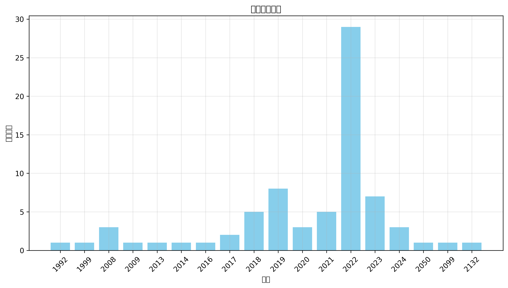

# 变身文学与小说存档库三（非限制级，持续更新） 数据分析
*生成日期：2025-02-27*

## 数据来源
数据来自 [变身文学与小说存档库三（非限制级，持续更新）](https://unovel.transchinese.org)

保存各类 CDTS、变身、伪娘、性转文学与变身小说存档，持续更新中。

## 执行摘要
本报告分析了 74 个项目的时间分布和主题分类。

## 时间分布

### 年度明细

| 年份 | 数量 |
|------|-------|
| 2132 | 1 |
| 2099 | 1 |
| 2050 | 1 |
| 2024 | 3 |
| 2023 | 7 |
| 2022 | 29 |
| 2021 | 5 |
| 2020 | 3 |
| 2019 | 8 |
| 2018 | 5 |
| 2017 | 2 |
| 2016 | 1 |
| 2014 | 1 |
| 2013 | 1 |
| 2009 | 1 |
| 2008 | 3 |
| 1999 | 1 |
| 1992 | 1 |

## 地区分布

  `未知: 223 (71.7%)`  `中国大陆: 85 (27.3%)`  `中国: 1 (0.3%)`  `日本: 1 (0.3%)`  `美国: 1 (0.3%)`

## 主题分析

### 标签词云

### 热门标签

**前50个热门标签：**

  `魔法: 180`  `变身: 174`  `奇幻: 158`  `冒险: 155`  `异世界: 116`  `成长: 97`  `二次元: 92`  `伪娘: 91`  `跨性别: 78`  `自我探索: 75`  `穿越: 68`  `青春: 64`  `性转: 61`  `轻小说: 61`  `性别认同: 59`  `校园: 57`  `重生: 53`  `战斗: 50`  `爱情: 49`  `后宫: 47`  `性别转换: 46`  `角色扮演: 44`  `友情: 42`  `幻想: 40`  `情感纠葛: 37`  `百合: 36`  `自我认同: 36`  `恋爱: 35`  `虚拟现实: 33`  `纯爱: 31`  `少女: 30`  `游戏: 30`  `身份认同: 29`  `幽默: 28`  `青春成长: 25`  `魔法少女: 24`  `转生: 23`  `勇者: 21`  `家庭: 20`  `权力斗争: 20`  `复仇: 19`  `奇幻冒险: 19`  `女主角: 19`  `搞笑: 19`  `自我认知: 19`  `女性主角: 16`  `校园生活: 16`  `都市: 16`  `女性角色: 15`  `情感: 15`

查看更多标签

 `生存: 15` `科幻: 15` `魔女: 15` `友谊: 14` `美少女: 14` `家庭关系: 13` `超能力: 13` `变装: 12` `心理斗争: 12` `角色成长: 12` `勇气: 11` `变嫁: 11` `嫁人: 10` `悬疑: 10` `男娘: 10` `变身小说: 9` `日常生活: 9` `温馨: 9` `玄幻: 9` `社会问题: 9` `系统: 9` `超自然: 9` `青春校园: 9` `修仙: 8` `兄妹情: 8` `变身嫁人: 8` `古代: 8` `女装: 8` `小说: 8` `成长故事: 8` `梦境: 8` `萝莉: 8` `亲情: 7` `励志: 7` `命运: 7` `女性向: 7` `幻想世界: 7` `异界: 7` `异能: 7` `日常: 7` `武侠: 7` `灵异: 7` `男主角: 7` `魔族: 7` `人际关系: 6` `修炼: 6` `反抗: 6` `女仆: 6` `妖精: 6` `姐妹情: 6` `心理成长: 6` `心理描写: 6` `探索: 6` `病态: 6` `精灵: 6` `言情: 6` `人生选择: 5` `仙侠: 5` `命运转折: 5` `婚姻: 5` `少年成长: 5` `平行世界: 5` `恐怖: 5` `悲剧: 5` `情感冲突: 5` `战争: 5` `末世: 5` `权谋: 5` `母女关系: 5` `治愈: 5` `神秘: 5` `系统流: 5` `舰娘: 5` `青梅竹马: 5` `魅魔: 5` `魔王: 5` `个人成长: 4` `二次元文化: 4` `公主: 4` `反派角色: 4` `变性: 4` `吸血鬼: 4` `复杂人际关系: 4` `女主: 4` `女性成长: 4` `妖怪: 4` `孤儿: 4` `少女心: 4` `心理冲突: 4` `性别转变: 4` `情感成长: 4` `情感探索: 4` `斗争: 4` `求生: 4` `神秘少女: 4` `科技幻想: 4` `职场: 4` `角色互动: 4` `身份危机: 4` `都市奇幻: 4` `青少年: 4` `魔法学院: 4` `魔法师: 4` `乡村生活: 3` `人工智能: 3` `兄弟情: 3` `初恋: 3` `制服: 3` `剧情发展: 3` `历史: 3` `反转人生: 3` `变百: 3` `古风: 3` `同性恋: 3` `圣剑: 3` `复生: 3` `奇幻世界: 3` `奇幻小说: 3` `女主成长: 3` `女儿: 3` `女孩: 3` `女性力量: 3` `姐妹: 3` `孤独: 3` `家族关系: 3` `少女成长: 3` `少年: 3` `异世界冒险: 3` `忠诚: 3` `悲伤: 3` `挣扎: 3` `救赎: 3` `时空穿越: 3` `暗恋: 3` `校园爱情: 3` `江湖: 3` `浪漫: 3` `温情: 3` `火影忍者: 3` `牺牲: 3` `猫娘: 3` `甜宠: 3` `病娇: 3` `社会压力: 3` `科技: 3` `精灵族: 3` `绝望与希望: 3` `能力觉醒: 3` `自我救赎: 3` `血腥: 3` `角色发展: 3` `贫困: 3` `身份探索: 3` `身体交换: 3` `轮回: 3` `逆袭: 3` `都市幻想: 3` `魔物: 3` `黑暗: 3` `黑暗奇幻: 3` `黑暗幻想: 3` `SM: 2` `TS: 2` `丧尸: 2` `人物关系: 2` `伙伴关系: 2` `修真: 2` `兄妹: 2` `公会: 2` `关系发展: 2` `养成: 2` `兽人: 2` `剑与魔法: 2` `剧情反转: 2` `力量觉醒: 2` `双子姐妹: 2` `双胞胎: 2` `双重生活: 2` `反击: 2` `叛逆: 2` `史莱姆: 2` `喜剧: 2` `外挂: 2` `多元宇宙: 2` `天使: 2` `天才: 2` `天才千金: 2` `失忆: 2` `奇幻生物: 2` `奋斗: 2` `契约: 2` `女儿身: 2` `女孩成长: 2` `女性化: 2` `女性身份: 2` `女生: 2` `女神: 2` `女英雄: 2` `女骑士: 2` `奴役: 2` `奴隶制: 2` `奴隶制度: 2` `妖女: 2` `姐姐: 2` `宠物: 2` `少女冒险: 2` `少年少女: 2` `屈辱: 2` `巫女: 2` `幻想冒险: 2` `废墟: 2` `强盗: 2` `强者: 2` `心灵成长: 2` `心理: 2` `心理变化: 2` `心理戏: 2` `心理战: 2` `心理探索: 2` `忍者: 2` `性别探索: 2` `性别角色: 2` `性转小说: 2` `恋爱喜剧: 2` `恐惧: 2` `感情纠葛: 2` `感情线: 2` `战舰: 2` `探索自我: 2` `探险: 2` `政治斗争: 2` `时间旅行: 2` `未来世界: 2` `末日: 2` `柜台小姐: 2` `校园恋爱: 2` `校园暴力: 2` `梦幻: 2` `梦想: 2` `次元: 2` `死亡: 2` `母爱: 2` `毒药: 2` `治愈系: 2` `流氓: 2` `深渊: 2` `潜入: 2` `灵魂: 2` `灵魂互换: 2` `灵魂交换: 2` `灵魂转世: 2` `灵魂转移: 2` `灾难: 2` `热血: 2` `爱恨情仇: 2` `特种部队: 2` `猎奇: 2` `王女: 2` `现代: 2` `现代生活: 2` `现代都市: 2` `甜蜜爱情: 2` `生存挑战: 2` `生存游戏: 2` `生死抉择: 2` `电竞: 2` `男主: 2` `男主成长: 2` `痛苦: 2` `直播: 2` `神器: 2` `神秘组织: 2` `穿越小说: 2` `职业技能: 2` `背叛: 2` `英雄: 2` `萌系: 2` `虐待: 2` `虐恋: 2` `虚构: 2` `血族: 2` `西幻: 2` `角色变身: 2` `贵族: 2` `超级英雄: 2` `逃亡: 2` `逆转: 2` `都市传说: 2` `都市生活: 2` `阴谋: 2` `陪伴: 2` `霸凌: 2` `青春期: 2` `非凡者: 2` `高中生: 2` `魔兽: 2` `魔幻: 2` `魔道具: 2` `龙娘: 2` `龙族: 2` `1980年代: 1` `ACG文化: 1` `BL: 1` `Cosplay: 1` `Fantasy: 1` `NPC: 1` `R-18: 1` `R18: 1` `SCP基金会: 1` `VUP: 1` `cosplay: 1` `sweetness: 1` `”dreamer: 1` `东方幻想乡: 1` `东煌: 1` `两性关系: 1` `丧尸题材: 1` `个人挣扎: 1` `个体成长: 1` `丫鬟: 1` `中世纪: 1` `主人与精灵: 1` `义弟情: 1` `乙女向: 1` `乡镇生活: 1` `二战: 1` `二次元情节: 1` `二次元设定: 1` `互动式叙述: 1` `互相理解: 1` `亡国公主: 1` `交错的命运: 1` `亲子关系: 1` `亲情故事: 1` `人与自然的冲突: 1` `人兽情: 1` `人性: 1` `人性和自我探索: 1` `人性探索: 1` `人族: 1` `人格分裂: 1` `人格复生: 1` `人格转变: 1` `人物成长: 1` `人生转变: 1` `仙女: 1` `仙家至宝: 1` `仙界: 1` `代表赛: 1` `任务系统: 1` `传奇: 1` `传承: 1` `传统玄幻: 1` `伦敦: 1` `伪装: 1` `佐罗传说: 1` `作者心声: 1` `佣兵: 1` `佣兵团: 1` `使命: 1` `侦探: 1` `俘虏: 1` `保护: 1` `信任: 1` `信任与依赖: 1` `信任危机: 1` `偶像练习生: 1` `偷拍事件: 1` `傲娇: 1` `像素风格: 1` `兄妹关系: 1` `光华女子学院: 1` `光明正大: 1` `克勃格帝国: 1` `克隆: 1` `克隆身份: 1` `全息游戏: 1` `全拟真游戏: 1` `公会管理: 1` `公公: 1` `关系冲突: 1` `兼职: 1` `兽耳: 1` `内力: 1` `内心成长: 1` `内心斗争: 1` `冒险任务: 1` `冒险故事: 1` `冒险旅程: 1` `冒险游戏: 1` `冒险经历: 1` `冒险者: 1` `冒险者公会: 1` `军事: 1` `军校: 1` `军队: 1` `冥界: 1` `冰雪魔法: 1` `冲突: 1` `冷晴: 1` `冷酷: 1` `冷酷少年: 1` `刀剑: 1` `创业: 1` `初中: 1` `刺激: 1` `剑姬: 1` `剑术: 1` `剑道: 1` `剥削: 1` `剧情: 1` `力量与责任: 1` `力量斗争: 1` `动态视力: 1` `动情: 1` `动植物: 1` `动漫文化: 1` `动漫衍生: 1` `动物救助: 1` `努力与坚持: 1` `努力与奋斗: 1` `努力改变: 1` `勇气与挑战: 1` `勇气与智慧: 1` `勇气与爱情: 1` `勇者与光之关系: 1` `勇者审判: 1` `勇者能力: 1` `北地雪域: 1` `医治: 1` `医院生活: 1` `千古一帝: 1` `升级: 1` `半妖: 1` `单亲家庭: 1` `单女主: 1` `单恋: 1` `卡牌: 1` `危机与救援: 1` `危险: 1` `历史交错: 1` `历史冲突: 1` `历史历史重绘: 1` `历史小说: 1` `历史幻想: 1` `历史推演: 1` `历史重塑: 1` `双向救赎: 1` `双重操控: 1` `双重身份: 1` `双鹰帝国: 1` `反乌托邦: 1` `反传统: 1` `反向攻略: 1` `反对歧视: 1` `反差人设: 1` `反恐行动: 1` `反派: 1` `反派女友: 1` `反派系统: 1` `反英雄: 1` `反转性别: 1` `变化: 1` `变身聊: 1` `变迁: 1` `古代剧情: 1` `古代文化: 1` `古代社会: 1` `古代神话: 1` `古墓探险: 1` `古文化: 1` `古风奇幻: 1` `古风情节: 1` `另类恋爱: 1` `召唤仪式: 1` `召唤师: 1` `可爱: 1` `可爱角色: 1` `同人小说: 1` `同学: 1` `同学关系: 1` `同居: 1` `同性恋主题: 1` `同班同学: 1` `后宫恋爱: 1` `后宫斗争: 1` `向日葵: 1` `吟游诗人: 1` `启示: 1` `命运交织: 1` `命运交错: 1` `命运法则: 1` `咒回: 1` `咖啡厅: 1` `哥布林: 1` `哲学思考: 1` `唐朝: 1` `唤醒本能: 1` `商业竞争: 1` `善恶: 1` `善恶交织: 1` `善良: 1` `回忆: 1` `团宠: 1` `团结: 1` `团队: 1` `团队协作: 1` `团队合作: 1` `困惑: 1` `国王游戏: 1` `国策: 1` `圣丹斯电影节: 1` `圣女: 1` `圣灵公主: 1` `地下室: 1` `地下迷宫: 1` `城市: 1` `城市冒险: 1` `堕落天使: 1` `塞伯利安人: 1` `增殖能力: 1` `壮丽人生: 1` `声优: 1` `复杂人性: 1` `复杂人物关系: 1` `复杂关系: 1` `复活: 1` `夏天歌: 1` `外卖员: 1` `多元性别: 1` `多角恋: 1` `夜晚: 1` `大白鲨: 1` `天使型角色: 1` `天女兽: 1` `天才魔法师: 1` `天赋觉醒: 1` `天魔宗: 1` `失去与寻找: 1` `失去与重获: 1` `失落的身份: 1` `奇幻文学: 1` `奇幻游戏: 1` `奇幻穿越: 1` `奇特任务: 1` `奇迹逆转: 1` `契约关系: 1` `契约魔女: 1` `奧斯卡: 1` `女主强: 1` `女主拯救: 1` `女主角成长: 1` `女主重生: 1` `女人角色: 1` `女仆装: 1` `女儿心: 1` `女军团长: 1` `女友: 1` `女同性恋: 1` `女天使: 1` `女子舍弃: 1` `女孩维权: 1` `女帝: 1` `女强: 1` `女性: 1` `女性主义: 1` `女性友谊: 1` `女性发育: 1` `女性独立: 1` `女性英雄: 1` `女性认同: 1` `女扮男装: 1` `女权: 1` `女权主义: 1` `女枪炮师: 1` `女王统治: 1` `女生化: 1` `女生系统: 1` `女老师: 1` `女角色: 1` `女高中生: 1` `女鬼: 1` `奴隶: 1` `奴隶契约: 1` `奶茶店: 1` `好莱坞: 1` `妖修: 1` `妖兽: 1` `妖兽入侵: 1` `妖族: 1` `妮可·基德曼: 1` `妹子: 1` `妹控: 1` `姐弟情: 1` `娱乐: 1` `娱乐圈: 1` `婚事: 1` `婚姻关系: 1` `婚姻危机: 1` `婚姻重建: 1` `婚约: 1` `婴儿生活: 1` `存在主义: 1` `孤儿故事: 1` `孤儿院: 1` `孤岛生存: 1` `学习压力: 1` `学习成长: 1` `学园: 1` `学城: 1` `学徒: 1` `学渣逆袭: 1` `学院: 1` `学霸: 1` `宗教改革: 1` `宗门: 1` `宝可梦: 1` `实验: 1` `实验室: 1` `宠物妄想: 1` `审判者: 1` `宫廷: 1` `宫廷争斗: 1` `家庭伦理: 1` `家庭冲突: 1` `家庭压力: 1` `家庭暴力: 1` `家庭虐待: 1` `家族: 1` `家族内斗: 1` `家族恩怨: 1` `家族悲剧: 1` `家族纷争: 1` `家暴: 1` `宿命转变: 1` `宿命转折: 1` `密教: 1` `富豪: 1` `富豪嫁入: 1` `对话: 1` `寻友: 1` `寻宝: 1` `寻找亲人: 1` `封建思想: 1` `小医仙: 1` `小说创作: 1` `少女与海军: 1` `少女强势: 1` `少年】]}: 1` `少年冒险: 1` `少年漫画: 1` `尴尬情境: 1` `尸体复生: 1` `山中井野: 1` `崩坏: 1` `工业革命: 1` `巨龙: 1` `巫师: 1` `师弟: 1` `师徒: 1` `师徒恋: 1` `师徒情: 1` `师徒情深: 1` `希茨菲尔: 1` `帝国政治: 1` `帝都: 1` `帮派争斗: 1` `平安时代: 1` `平淡人生: 1` `平阳公主: 1` `年代: 1` `幻想乡: 1` `幻想剧情: 1` `幻想小说: 1` `幻想文学: 1` `幻术: 1` `幻觉: 1` `幼馴染: 1` `幽灵舞蹈: 1` `庄园: 1` `废萌: 1` `异世界探索: 1` `异性恋: 1` `异火: 1` `异界探险: 1` `异类变身: 1` `弱者: 1` `弱者逆袭: 1` `强大女性角色: 1` `归属感: 1` `微观世界: 1` `心动: 1` `心灵冲突: 1` `心灵探索: 1` `心灵穿越: 1` `心理健康: 1` `心理咨询: 1` `心理幻想: 1` `心理挣扎: 1` `心理探讨: 1` `心理暗示: 1` `心理社会: 1` `心脏病: 1` `忍者学校: 1` `忠臣: 1` `性别流动: 1` `性别转化: 1` `怨恨: 1` `怪人: 1` `怪物: 1` `怪盗: 1` `怪诞生物: 1` `恋人: 1` `恋爱故事: 1` `恐惧与勇气: 1` `恶女: 1` `恶搞: 1` `恶神: 1` `恶贯盈仇: 1` `恶魔: 1` `恶魔猎手: 1` `悔恨: 1` `悲怆: 1` `情感互动: 1` `情感关系: 1` `情感剧: 1` `情感危机: 1` `情感发展: 1` `情感教育: 1` `情感重建: 1` `情欲: 1` `情诗: 1` `惊悚: 1` `意识重生: 1` `感人故事: 1` `慢热: 1` `成人游戏: 1` `成年人: 1` `成长困境: 1` `成长小说: 1` `成长痛: 1` `战争策略: 1` `战利品: 1` `战友情谊: 1` `战役: 1` `战斗本能: 1` `战斗法则: 1` `战斗系统: 1` `战斗训练: 1` `战术分析: 1` `战略: 1` `战略合作: 1` `打脸: 1` `扭曲: 1` `抉择: 1` `抒情: 1` `拍卖师: 1` `招募同伴: 1` `挑战: 1` `挣扎求生: 1` `换身体: 1` `捧心事: 1` `掌门: 1` `探案: 1` `控制欲: 1` `推理: 1` `搞笑元素: 1` `收养: 1` `改变命运: 1` `改革: 1` `政治: 1` `故事: 1` `故事探索: 1` `故事沉浸: 1` `教会: 1` `数码兽: 1` `数码宝贝: 1` `文化冲突: 1` `文化现象: 1` `文学作品: 1` `文艺: 1` `文野: 1` `斗帝: 1` `斗智: 1` `斗智斗勇: 1` `斗智斗狠: 1` `斗气: 1` `斗气修炼: 1` `斗气大陆: 1` `料理: 1` `新世界: 1` `新月秘境: 1` `新生机遇: 1` `无助与勇气: 1` `无厘头: 1` `无敌: 1` `无毒无害: 1` `无系统: 1` `日本: 1` `时代变迁: 1` `时空双神: 1` `时空旅行: 1` `时空穿梭: 1` `时间操控: 1` `昆汀·塔伦蒂诺: 1` `暗杀: 1` `暴力事件: 1` `替代身份: 1` `月票: 1` `月读命: 1` `朝堂之上: 1` `未来战争: 1` `未来科技: 1` `末日废墟: 1` `机智: 1` `机械: 1` `机械少女: 1` `杀人鬼: 1` `权利游戏: 1` `权力: 1` `权力与血统: 1` `权力争夺: 1` `权力关系: 1` `极权主义: 1` `林克导演: 1` `校园恋: 1` `校服: 1` `校花: 1` `梦中情人: 1` `森女: 1` `森林: 1` `森林探险: 1` `植物变身: 1` `模拟人生: 1` `次元文明: 1` `次元穿越: 1` `正义与邪恶: 1` `正派系统: 1` `武侠玄幻: 1` `武功修炼: 1` `武器: 1` `武器锻造: 1` `武士: 1` `武林: 1` `武者: 1` `武道: 1` `死亡与重生: 1` `死亡游戏: 1` `死者森林: 1` `残酷: 1` `残酷合同: 1` `母女情: 1` `母子关系: 1` `母爱与责任: 1` `毒师: 1` `毒素技能: 1` `毒贩: 1` `毛利兰: 1` `氪金系统: 1` `水下: 1` `水下世界: 1` `水晶: 1` `江湖人物: 1` `江湖纷争: 1` `沉浸式体验: 1` `沙漠: 1` `沙雕幽默: 1` `泰伦人: 1` `测试: 1` `海战: 1` `海洋: 1` `海贼王: 1` `润滑剂: 1` `深冬情景: 1` `深渊魔兽: 1` `渣男: 1` `渣男元素: 1` `温情家庭: 1` `温暖与陪伴: 1` `温柔: 1` `温泉: 1` `温馨家庭: 1` `游戏世界: 1` `游戏制作: 1` `游戏头盔: 1` `游戏开发: 1` `游戏攻略: 1` `游戏测试: 1` `游戏爱好者: 1` `游戏穿越: 1` `游戏竞技: 1` `游戏背景: 1` `演戏: 1` `漩涡中的希望: 1` `漫威宇宙: 1` `漫画: 1` `漫画改编: 1` `澜云妖院: 1` `火星: 1` `灵力: 1` `灵动武装: 1` `灵天长生造化宝泉: 1` `灵异事件: 1` `灵异现象: 1` `灵异直播间: 1` `灵法师: 1` `灵魂交易: 1` `灵魂分裂: 1` `灵魂操控: 1` `灵魂武器: 1` `灵魂穿越: 1` `灵魂融合: 1` `灵魂觉醒: 1` `灵魂附身: 1` `灾厄之龙: 1` `炼丹: 1` `爱与友情: 1` `爱与希望: 1` `爱与牺牲: 1` `爱与痛苦: 1` `爱恋: 1` `爱情告白: 1` `爱情故事: 1` `父女关系: 1` `父权: 1` `爽文: 1` `牢房: 1` `特殊能力: 1` `特警: 1` `牺牲与希望: 1` `牺牲与责任: 1` `犬夜叉: 1` `狐狸: 1` `狙击手: 1` `狩猎: 1` `独占: 1` `独立: 1` `独立游戏: 1` `独立电影: 1` `独角兽: 1` `狼的攻击: 1` `猎杀者: 1` `猫: 1` `猫咪魔兽: 1` `猫魔女: 1` `献祭: 1` `王宫生活: 1` `现代奇幻: 1` `现代恋爱: 1` `现代战争: 1` `现代社会: 1` `现实与梦境: 1` `现实与虚拟: 1` `现实主义: 1` `现实题材: 1` `理想社会: 1` `甜虐交织: 1` `生命的希望: 1` `生存冒险: 1` `生存斗争: 1` `生存欲望: 1` `生死: 1` `生死决斗: 1` `生死存亡: 1` `生死游戏: 1` `生死界限: 1` `生死轮回: 1` `生活习惯: 1` `生活压力: 1` `生活困扰: 1` `生活日常: 1` `生活片段: 1` `电子歌姬: 1` `电影制作: 1` `电影发行: 1` `电影节颁奖: 1` `男主女主: 1` `男儿: 1` `男儿身: 1` `男女关系: 1` `男女平等: 1` `男孩: 1` `男孩变女孩: 1` `男孩变女生: 1` `男孩转变: 1` `男性变女性: 1` `男性角色: 1` `男性角色变化: 1` `男装: 1` `番外: 1` `疼痛与治疗: 1` `病弱公主: 1` `病态心理: 1` `病房生活: 1` `白雪公主: 1` `皇帝: 1` `盟友: 1` `相互救赎: 1` `相思: 1` `真实感受: 1` `矛盾: 1` `短发御姐: 1` `矿井: 1` `研究: 1` `破坏神: 1` `破碎的家园: 1` `社交: 1` `社会主题: 1` `社会互动: 1` `社会人: 1` `社会关注: 1` `社会危机: 1` `社会变革: 1` `社会底层: 1` `社会性别: 1` `社会改革: 1` `社会构建: 1` `社会现象: 1` `社会认同: 1` `社会边缘人: 1` `社会适应: 1` `社畜生活: 1` `神圣技能: 1` `神明: 1` `神界幻想: 1` `神秘力量: 1` `神秘学: 1` `神秘废墟: 1` `神秘森林: 1` `神秘生物: 1` `神秘石头: 1` `神秘网友: 1` `神秘萝莉: 1` `神话: 1` `神话生物: 1` `神话角色: 1` `神选者: 1` `票房对赌: 1` `禁忌爱情: 1` `禁忌物: 1` `禁忌知识: 1` `种族创造: 1` `科学实验: 1` `科学幻想: 1` `科幻小说: 1` `科技文明: 1` `秘密恋情: 1` `租房问题: 1` `程序员: 1` `空手道大赛: 1` `空间能力: 1` `穿越文学: 1` `竞争与挑战: 1` `童年: 1` `童话: 1` `第一人称视角: 1` `第二性征: 1` `第二次人生: 1` `篮球: 1` `粉色薄雾: 1` `精灵宝可梦: 1` `精灵少女: 1` `精神健康: 1` `精神困惑: 1` `精神复苏: 1` `精神疾病: 1` `精美插图: 1` `系统类小说: 1` `紧急应对: 1` `紧身衣女: 1` `红世: 1` `约会大作战: 1` `经济困难: 1` `经济学: 1` `绑架: 1` `绝世美女: 1` `绝望故事: 1` `维斯共和国: 1` `网络互动: 1` `网络小说: 1` `网络游戏: 1` `美好生活: 1` `美少年: 1` `群体冲突: 1` `群体命运: 1` `群体生存: 1` `考古: 1` `耳语刺激: 1` `聊天群: 1` `职业女性: 1` `职业系统: 1` `职业选择: 1` `职场压力: 1` `职场奋斗: 1` `职场学习: 1` `职场斗争: 1` `肉食动物: 1` `胁迫: 1` `能力副作用: 1` `能力战斗: 1` `能力提升: 1` `腐向: 1` `腐女: 1` `自我反省: 1` `自我发现: 1` `自我成长: 1` `自杀危机: 1` `自然神论: 1` `致郁文: 1` `艺人生活: 1` `艺术: 1` `艺术电影: 1` `艾灵莎: 1` `艾苏恩: 1` `苏晓玲: 1` `苦涩的食物: 1` `英勇: 1` `英日混血: 1` `英雄主义: 1` `英雄故事: 1` `草帽海贼团: 1` `草神: 1` `药材: 1` `药物: 1` `药物影响: 1` `药物成瘾: 1` `莉格露·奈特巴格: 1` `萝莉控: 1` `萝莉魔王: 1` `虐心: 1` `虚假英雄: 1` `虚幻世界: 1` `虚拟世界: 1` `虚拟游戏: 1` `虚拟系统: 1` `虚构世界: 1` `虚构历史: 1` `虚构故事: 1` `血玫瑰: 1` `血祭: 1` `血肉之花: 1` `血腥狩猎: 1` `血龙族: 1` `西方奇幻: 1` `规则怪谈: 1` `觉醒者: 1` `角色关系: 1` `角色替换: 1` `角色认同: 1` `角色转变: 1` `角色转换: 1` `警匪: 1` `警察: 1` `许愿池: 1` `设定背景: 1` `评审团大奖: 1` `诅咒: 1` `试道大会: 1` `诡异事件: 1` `诺斯人: 1` `调教: 1` `豪杰: 1` `财富: 1` `责任: 1` `责任与救赎: 1` `贫困少女: 1` `贫富差距: 1` `贫穷: 1` `贵族教育: 1` `贵族社会: 1` `贵族联姻: 1` `赛亚人: 1` `赛博朋克: 1` `超凡力量: 1` `超现实: 1` `超维地图: 1` `超自然事件: 1` `超自然生物: 1` `跨性别角色: 1` `跨时代: 1` `身世秘密: 1` `身份转变: 1` `身心体验: 1` `转变: 1` `转职系统: 1` `轮回世界: 1` `轮回乐园: 1` `轻松: 1` `追寻希望: 1` `追求自我: 1` `逃婚: 1` `逃脱计划: 1` `逃避与迎接: 1` `逆境成长: 1` `选择神: 1` `道教: 1` `避难所: 1` `邪恶科学家: 1` `邪灵: 1` `邪神: 1` `都市小说: 1` `都市情感: 1` `都市情缘: 1` `都市日常: 1` `酒馆: 1` `里番: 1` `重伤: 1` `重度网瘾少年: 1` `重建文明: 1` `野外探索: 1` `钓鱼: 1` `铜币掉落: 1` `银发女性: 1` `银发角色: 1` `错位恋爱: 1` `间谍: 1` `队伍合作: 1` `阳气与阴气: 1` `阴暗: 1` `阴暗势力: 1` `阴暗牧师: 1` `阴气: 1` `阴阳师: 1` `阴阳草: 1` `阴阳阁: 1` `阴雨天: 1` `除妖师: 1` `隐藏身份: 1` `隐藏门派: 1` `隔阂: 1` `障碍克服: 1` `霍格沃兹: 1` `露出: 1` `青云宗: 1` `青少年文学: 1` `青春叛逆: 1` `青春奇幻: 1` `青春奋斗: 1` `青春小说: 1` `青春爱情: 1` `青楼: 1` `非人: 1` `非攻略对象: 1` `面具: 1` `音乐: 1` `风见幽香: 1` `飞升: 1` `飞行: 1` `食物探寻: 1` `骑乘: 1` `骑士: 1` `骚扰与霸凌: 1` `骷髅: 1` `高颜值: 1` `鬼: 1` `鬼怪: 1` `鬼畜: 1` `鬼魂: 1` `魂系: 1` `魔力觉醒: 1` `魔契: 1` `魔女之夜: 1` `魔导书: 1` `魔幻现实主义: 1` `魔改设定: 1` `魔法力量: 1` `魔法实验: 1` `魔法袭击: 1` `魔法课堂: 1` `魔法转变: 1` `魔法阵: 1` `魔法革命: 1` `魔界: 1` `魔皇: 1` `魔药: 1` `魔镜: 1` `魔鬼海域: 1` `黑卡蒂: 1` `黑帮: 1` `黑暗与光明: 1` `黑暗圣典: 1` `黑暗实验: 1` `黑暗风: 1` `黑暗魔法: 1` `黑科技: 1` `黑莲花: 1` `黑袍人: 1` `黑龙: 1` `龙: 1` `龙人: 1` `龙珠: 1` `龙骑士: 1` `龙龙少女: 1`

## 说明
- 所有统计数据截至报告生成日期
- 标签保持原始大小写形式